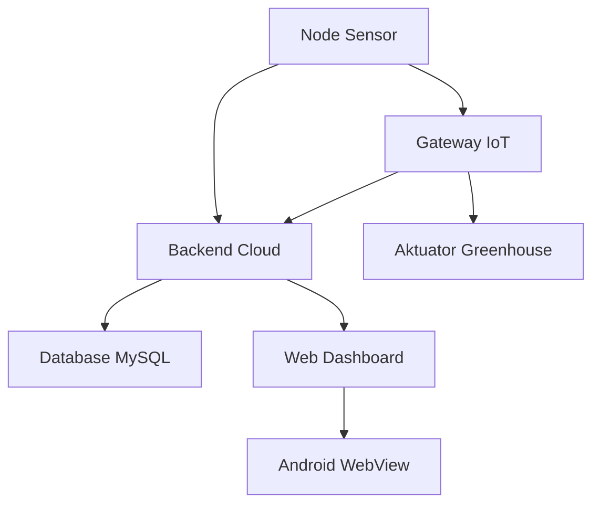

# Mulai dari Sini

Dokumentasi ini dibuat untuk menjelaskan sistem Tugas Akhir IoT Greenhouse dari nol. Pembaca tidak perlu merasa harus paham pemrograman, IoT, server, database, Android, atau jaringan sebelum membaca bagian ini.

Tujuan halaman ini adalah memberi arah: apa yang harus dibaca dulu, bagaimana cara membaca kode secara perlahan, dan bagaimana semua komponen saling terhubung dalam sistem greenhouse anggrek.

## Sistem Ini Tentang Apa

Sistem ini adalah sistem pemantauan dan pengendalian mikro iklim greenhouse anggrek. Ada perangkat fisik yang membaca kondisi lingkungan, ada gateway yang membantu kendali lokal, ada server yang menyimpan data, ada dashboard web, dan ada aplikasi Android berbasis WebView.

Secara sederhana:

1. Node sensor membaca suhu, kelembapan, dan cahaya.
2. Data dikirim ke gateway lokal atau server cloud.
3. Backend menyimpan dan menyediakan data melalui API.
4. Web dashboard menampilkan data dan kontrol.
5. Android membuka dashboard agar bisa dipakai dari ponsel.
6. Gateway dapat mengendalikan aktuator seperti fan, exhaust, dehumidifier, relay, atau SSR sesuai threshold dan jadwal.

## Cara Pakai Dokumentasi Ini

Jika benar-benar mulai dari nol, baca berurutan:

1. [Cara Membaca Docs](./cara-membaca-docs.md)
2. [Glossary](./glossary.md)
3. [Peta Belajar](./peta-belajar.md)
4. [Apa Itu Program](../01-programming-fundamentals/apa-itu-program.md)
5. [File, Folder, dan Project](../01-programming-fundamentals/file-folder-project.md)
6. Lanjutkan ke bagian konteks TA, arsitektur, lalu file-by-file.

Jika sudah paham dasar pemrograman, langsung baca peta belajar dan coverage report:

- [Peta Belajar](./peta-belajar.md)
- [Coverage Report](../14-complete-file-walkthrough/coverage-report.md)

## Cara Membaca Kode dengan Aman

Saat membaca kode, jangan langsung mulai dari detail paling kecil. Pakai urutan ini:

1. Pahami tujuan file.
2. Cari kapan file dipakai.
3. Cari data yang masuk.
4. Cari data yang keluar.
5. Cari fungsi penting.
6. Cari bagian yang bisa gagal.
7. Baru baca baris atau blok kode detail.

Cara ini penting karena kode IoT tidak berdiri sendiri. Satu file bisa berhubungan dengan sensor, Wi-Fi, cache, API, relay, database, dan tampilan web.

## Status Dokumentasi

Dokumentasi masih bertahap. Tahap inventory sudah dibuat di:

- [Coverage Report](../14-complete-file-walkthrough/coverage-report.md)
- [Full File Inventory](../99-generated/full-file-inventory.md)
- [Full Folder Inventory](../99-generated/full-folder-inventory.md)

Inventory membantu pembaca melihat file apa saja yang ada. Halaman detail menjelaskan peran file tersebut dalam sistem, sehingga pembaca tidak hanya melihat daftar nama file.

## Hal Penting untuk Pembaca Baru

Tidak apa-apa jika istilah seperti API, firmware, WebSocket, AES, cache, atau database terasa asing. Istilah-istilah itu akan dijelaskan bertahap. Fokus pertama adalah memahami gambaran besar, bukan menghafal semua istilah.

Lanjutkan ke [Cara Membaca Docs](./cara-membaca-docs.md).
