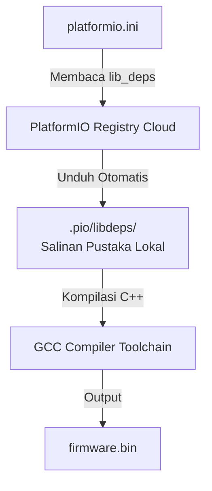

# Stack Firmware Arduino & PlatformIO

Pengembangan firmware pada proyek Tugas Akhir ini tidak menggunakan Arduino IDE biasa, melainkan menggunakan **PlatformIO** (ekstensi IDE berbasis VS Code atau CLI). PlatformIO memberikan kontrol penuh terhadap manajemen pustaka (*dependency management*), konfigurasi build, pemisahan partisi memori, dan otomasi unggah (*uploading*) kode.

Halaman ini menguraikan bagaimana PlatformIO mengelola proyek C++, merinci fungsi pustaka eksternal yang terpasang, serta memaparkan cara integrasi yang aman untuk sistem berbasis **ESP8266 (Node Sensor)** dan **ESP32 (Gateway)**.

---

## 1. Manajemen Dependensi via platformio.ini

Berkas `platformio.ini` adalah file konfigurasi pusat untuk mendefinisikan build environment. Di dalam proyek ini, manajemen pustaka eksternal diatur menggunakan parameter `lib_deps`. PlatformIO akan mengunduh pustaka ini secara otomatis ke dalam direktori `.pio/libdeps/` saat proses kompilasi pertama dijalankan.



### A. Konfigurasi Penting Node (ESP8266)
Konfigurasi `platformio.ini` pada Node Sensor ditargetkan untuk efisiensi RAM:
*   **Platform & Framework**: `platform = espressif8266` dan `framework = arduino`.
*   **Filesystem**: Ditetapkan menggunakan `board_build.filesystem = littlefs`.
*   **Compiler Flags**: Menggunakan flag optimasi ukuran berkas biner:
    ```ini
    build_unflags = -std=gnu++11
    build_flags =
        -std=gnu++20
        -ffunction-sections
        -fdata-sections
        -Wl,--gc-sections
    ```
    *   `-std=gnu++20`: Membuka fitur C++20 modern seperti `std::span` dan template modern.
    *   `-ffunction-sections`, `-fdata-sections`, dan `--gc-sections`: Memerintahkan kompiler untuk menaruh setiap fungsi pada section tersendiri dan membuang kode/pustaka yang dideklarasikan tetapi tidak pernah dipanggil (*dead code elimination*), sangat krusial untuk menghemat memori Flash ESP8266.

### B. Konfigurasi Penting Gateway (ESP32)
Konfigurasi Gateway difokuskan pada multitasking dan pembagian partisi:
*   **Platform & Board**: `platform = espressif32` dan `board = esp32dev`.
*   **Skema Partisi**: Menggunakan tabel partisi kustom (`board_build.partitions = partitions_custom.csv`) untuk mendukung update OTA dua partisi (*Dual-OTA partition layout*) dan menyisakan ruang untuk partisi NVS (*Non-Volatile Storage*) yang menampung konfigurasi Preferences.
*   **Greenhouse ID Routing**: Menggunakan build flags kustom untuk membedakan target build:
    ```ini
    build_flags =
        -D GH_ID_CONFIG=1
        -D FW_VERSION_ID=\"1.0.4\"
    ```
    Hal ini memungkinkan satu basis kode C++ yang sama dikompilasi menjadi firmware berbeda untuk Greenhouse 1 atau Greenhouse 2 secara otomatis tanpa menyalin proyek.

---

## 2. Rincian Pustaka & Cara Penggunaannya di Kode

Berikut adalah pembedahan pustaka eksternal utama yang digunakan, peranannya dalam sistem, dan letak implementasinya pada kode sumber:

### A. Komunikasi HTTP & Asinkron
*   **`ESPAsyncWebServer` & `ESPAsyncTCP` (ESP8266) / `AsyncTCP` (ESP32)**
    *   *Deskripsi*: Pustaka web server asinkron. Berbeda dengan server bawaan Arduino yang memblokir proses (*blocking*), server ini berjalan di latar belakang berbasis event.
    *   *Penggunaan*: Menangani portal penyiapan Wi-Fi lokal, endpoint status `/api/status`, dan console terminal WebSerial.
*   **`HTTPClient` (Pustaka Inti Expressif)**
    *   *Deskripsi*: Pustaka klien HTTP untuk mengirim request GET/POST.
    *   *Penggunaan*: Dipakai oleh `ApiClient` untuk mengirim data sensor berkala ke Laravel Cloud dan mengambil konfigurasi threshold. Di Gateway, klien ini dibungkus menggunakan `BearSSL::WiFiClientSecure` untuk menangani enkripsi TLS.

### B. Serialisasi & Parsing Data (JSON)
*   **`ArduinoJson` (oleh Benoit Blanchon)**
    *   *Deskripsi*: Pustaka parsing dan serialisasi dokumen JSON yang sangat efisien untuk mikrokontroler.
    *   *Penggunaan*: Mengurai (*parsing*) jadwal dari database Laravel dan mengemas telemetri sensor saat dikirim via HTTP.
    *   *Praktik Terbaik Memori*:
        Pustaka ini menyediakan dua kelas manajemen memori: `StaticJsonDocument` (alokasi di Stack) dan `DynamicJsonDocument` (alokasi di Heap).
        *   Pada Node (ESP8266), buffer dibatasi secara ketat menggunakan `StaticJsonDocument<256>` karena alokasi stack berukuran kecil lebih aman dari ancaman fragmentasi memori.
        *   Pada Gateway (ESP32), pengolahan jadwal kustom berukuran besar dialokasikan di Heap via `DynamicJsonDocument` dengan perhitungan kapasitas yang presisi (`JSON_OBJECT_SIZE` + overhead string) untuk menghindari kegagalan alokasi.

### C. Manajemen Sensor & Hardware I2C
*   **`BH1750` & `arduino-sht` (SHT31)**
    *   *Deskripsi*: Driver sensor cahaya BH1750 dan sensor suhu-kelembapan SHT31.
    *   *Penggunaan*: Digunakan pada Node Sensor di dalam modul `SensorManager.cpp`. Pustaka ini diakses menggunakan bus I2C (`Wire.h`).
*   **`RTClib` (oleh Adafruit)**
    *   *Deskripsi*: Driver kontroler waktu RTC fisik DS3231.
    *   *Penggunaan*: Digunakan pada Gateway di dalam modul `RTCManager.cpp` untuk menyediakan pencatatan waktu berpresisi tinggi yang tetap berjalan saat perangkat mati total.
*   **`LiquidCrystal_I2C`**
    *   *Deskripsi*: Pustaka untuk menampilkan teks ke layar karakter LCD 20x4 via I2C backpack.
    *   *Penggunaan*: Digunakan pada Gateway di dalam modul `LCDDisplay.cpp`.

### D. Jaringan Seluler GPRS (Gateway)
*   **`TinyGSM`**
    *   *Deskripsi*: Pustaka modem GSM/GPRS yang sangat portabel.
    *   *Penggunaan*: Dipakai pada Gateway oleh `MyNetworkManager.cpp` untuk mengemudikan modem SIM800L melalui komunikasi serial UART (`HardwareSerial`). Pustaka ini menyediakan antarmuka `TinyGsmClient` yang kompatibel dengan protokol soket client HTTP Arduino standar, memudahkan pergantian jalur koneksi (*failover*) dari Wi-Fi ke GPRS secara transparan.

---

## 3. Praktik Terbaik Penanganan Pustaka pada Sistem Real-Time

Menggabungkan banyak pustaka eksternal pada satu mikrokontroler sering memicu masalah runtime jika tidak dikelola dengan benar. Berikut adalah aturan arsitektur yang diterapkan di codebase:

### A. Aturan Non-Blocking pada Pustaka Asinkron
Pustaka `ESPAsyncWebServer` mengeksekusi fungsi callback route web pada *thread* sistem penanganan jaringan internal (bukan pada loop utama).
*   **Masalah**: Jika Anda melakukan operasi penulisan LittleFS, pemanggilan API HTTP eksternal, atau modifikasi memori yang lama di dalam fungsi callback route, mikrokontroler akan mengalami *hang* atau terpicu Watchdog Reset.
*   **Solusi**: Gunakan pola **Deferred Actions** (Jalur Servis Tertunda). Callback route web hanya bertugas memparsing payload, memvalidasi data, memasukkannya ke dalam antrean aman di RAM, dan langsung mengembalikan respon HTTP sukses. Proses penulisan NVS/LittleFS atau perubahan status relai yang berat didelegasikan ke loop utama (`loop()`) pada iterasi berikutnya melalui kelas pembantu kustom seperti `DeferredControlActions.h`.

### B. Pengurangan Fragmentasi Heap pada Alokasi Pustaka
Fungsi enkripsi `mbedtls` atau parsing JSON berulang-ulang dapat menguras Heap secara acak, menyisakan RAM dalam bentuk pecahan-pecahan kecil (*fragmented memory*).
*   **Pencegahan**: Instansiasi objek enkripsi BearSSL atau parser JSON berukuran besar tidak dilakukan di dalam loop internal yang berjalan cepat. Objek enkripsi yang sering digunakan dideklarasikan sekali sebagai instansiasi bersama (*shared instances*) yang reusable (misalnya `CryptoUtils::sharedCipher()` dan `sharedCipherWs()`).
*   **Pelepasan Terjadwal**: Memori scratch buffer yang digunakan untuk kompresi data dilepas secara manual menggunakan fungsi pembebas memori (`releaseMainCipherScratch()`) sesaat setelah operasi pengiriman data API selesai.

Lanjutkan ke bagian **[C++ Modern 11-20 di Firmware](./cpp-modern-11-20.md)** untuk melihat rincian pemanfaatan C++ standar baru pada pustaka-pustaka ini.
