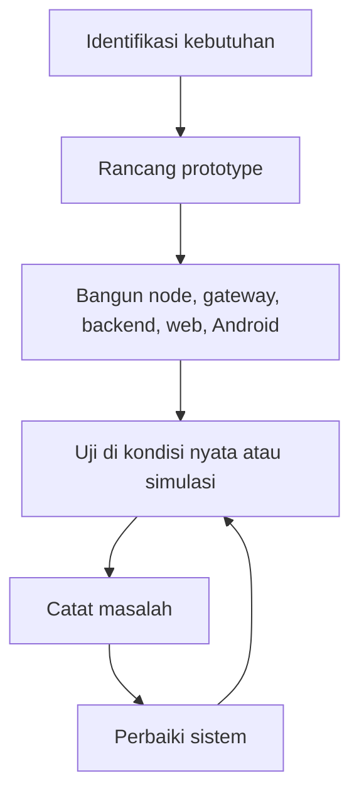

# Metodologi Prototyping

Prototyping adalah metode pengembangan dengan membuat versi awal sistem, mencoba, mengevaluasi, lalu memperbaiki. Metode ini cocok untuk sistem IoT karena perangkat keras, firmware, jaringan, backend, dan dashboard perlu diuji bersama.

## Alur Prototyping Sederhana

## Kenapa Cocok untuk IoT Greenhouse

Sistem IoT tidak hanya diuji dari kode. Sistem harus berhadapan dengan:

- sensor fisik,
- Wi-Fi,
- power supply,
- delay jaringan,
- data yang hilang,
- kondisi greenhouse nyata,
- aktuator yang punya efek fisik,
- kebutuhan pengguna dashboard.

Karena itu, prototype membantu menemukan masalah yang tidak terlihat hanya dari membaca kode.

## Hubungan dengan Dokumentasi

Dokumentasi mencatat hasil prototyping jika datanya tersedia. Contohnya:

- perubahan threshold,
- perbaikan caching,
- pengujian OTA,
- perbaikan tampilan dashboard,
- perubahan wiring,
- error jaringan yang ditemukan.

Jika tidak ada bukti atau data, jangan menulis seolah hasil sudah diuji.

Lanjutkan ke [Judul dan Latar Belakang](./judul-dan-latar-belakang.md) jika ingin mengulang konteks, atau lanjut ke fondasi sistem.
