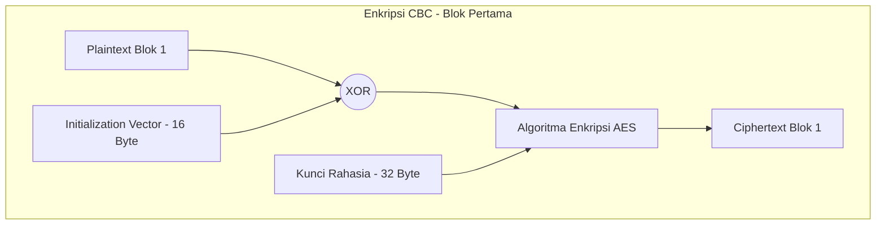

# Keamanan Data dengan AES-256-CBC

Meskipun jalur HTTPS sudah mengamankan data di tengah jalan (*in transit*), firmware node juga memiliki lapisan enkripsi aplikasi untuk jalur lokal/terminal tertentu. Implementasinya menggunakan algoritma **AES-256-CBC** di `CryptoUtils`.

Mari kita bedah secara mendalam bagaimana algoritma ini bekerja, struktur padding-nya, hingga proteksi replay attack yang diimplementasikan.

---

## Konsep Dasar AES-256-CBC

1. **AES (Advanced Encryption Standard)**
   Merupakan algoritma enkripsi simetris (menggunakan kunci yang sama untuk mengenkripsi dan mendekripsi). AES membagi data menjadi blok-blok tetap berukuran **16 byte (128 bit)**. Angka **256** menunjukkan panjang kunci rahasia yang digunakan, yaitu **256 bit (32 byte)**, memberikan tingkat keamanan setara standar militer.

2. **CBC (Cipher Block Chaining) Mode**
   Dalam mode CBC, sebelum sebuah blok plaintext dienkripsi, ia akan di-XOR terlebih dahulu dengan blok ciphertext hasil enkripsi sebelumnya. Hal ini menjamin bahwa dua blok plaintext yang identik akan menghasilkan ciphertext yang berbeda saat dienkripsi.

3. **IV (Initialization Vector)**
   Karena blok pertama tidak memiliki blok ciphertext sebelumnya untuk di-XOR, kita membutuhkan nilai acak pembuka yang disebut **IV (Initialization Vector)** berukuran **16 byte**. IV harus selalu acak dan unik untuk setiap enkripsi baru.



---

## Mekanisme PKCS7 Padding

Karena AES mengharuskan panjang data yang dienkripsi berkelipatan tepat **16 byte**, data asli (plaintext) yang ukurannya tidak pas harus diberi ganjalan (**padding**). Sistem ini menggunakan standar **PKCS7 Padding**.

Aturan PKCS7 sangat sederhana: **Nilai byte padding yang ditambahkan adalah sama dengan jumlah byte yang ditambahkan.**

* **Contoh 1 (Butuh 3 byte padding):**
  Jika panjang data adalah 13 byte (kurang 3 byte untuk mencapai 16), kita menambahkan 3 byte di akhir dengan nilai `0x03`.
  `Plaintext Asli:  [D A T A A S L I D A T A A]` (13 byte)
  `Setelah Padding: [D A T A A S L I D A T A A] [0x03] [0x03] [0x03]` (16 byte)

* **Contoh 2 (Pas kelipatan 16 byte):**
  Jika data asli sudah pas berukuran 16 byte, kita *wajib* menambahkan satu blok padding penuh berisi 16 byte dengan nilai `0x10` (desimal 16). Ini dilakukan agar saat didekripsi, sistem tidak bingung membedakan apakah byte terakhir adalah data asli atau padding.

Saat proses dekripsi, sistem akan membaca nilai byte paling terakhir (misal `N`), memverifikasi apakah `N` byte terakhir memang bernilai `N`, lalu membuang `N` byte tersebut untuk mendapatkan data asli.

---

## Format Payload Transmisi

Data terenkripsi dikirimkan dalam format teks ringkas yang dipisahkan oleh tanda titik dua (`:`):

$$\text{Payload} = \text{Base64(IV)} : \text{Base64(Ciphertext)}$$

* **Base64(IV):** IV acak (16 byte) yang dikodekan ke teks Base64 (~24 karakter).
* **Base64(Ciphertext):** Data terenkripsi (kelipatan 16 byte) yang dikodekan ke Base64.

Penerima data cukup memisahkan string menggunakan pemisah `:`, melakukan dekode Base64 pada masing-masing bagian, lalu memasukkannya ke mesin dekripsi AES.

---

## Proteksi Replay Attack (Timestamp Prefix)

Salah satu celah keamanan terbesar pada perintah jarak jauh adalah **Replay Attack**. Penyerang dapat merekam paket data perintah terenkripsi, misalnya perintah menyalakan relay dehumidifier 2 kW, lalu mengirimkannya kembali ke node di waktu lain untuk menyalakan aktuator besar itu tanpa izin. Meskipun penyerang tidak tahu isi pesannya, paket lama itu masih bisa terlihat seperti payload terenkripsi yang valid jika tidak ada pemeriksaan waktu.

Untuk mengatasinya, sistem kita menyisipkan **Unix Timestamp 4-byte** (dalam format Big Endian/Network Byte Order) tepat di awal plaintext sebelum enkripsi dilakukan.

```text
Plaintext Sebelum Enkripsi = [Timestamp (4-Byte)] + [Pesan Asli]
```

Mekanisme Validasi Penerimaan:
1. Penerima mendekripsi data dan memisahkan 4 byte pertama.
2. 4 byte tersebut disusun kembali menjadi angka timestamp Unix (waktu detik).
3. Penerima mengambil waktu saat ini dari jam perangkat (disinkronkan lewat NTP).
4. Penerima menghitung selisih waktu: $\Delta t = |t_{\text{sekarang}} - t_{\text{payload}}|$.
5. Payload **ditolak** jika $\Delta t$ melebihi batas toleransi (*skew window*). Nilai default ketat di kode saat ini adalah **30 detik**, dapat dilonggarkan sampai batas maksimum **900 detik**.

---

## Implementasi di Codebase

Aktivitas kriptografi ini tersebar di dua lingkungan yang berbeda:

1. **Sisi Firmware Node (C++) - `CryptoUtils.cpp`**
   Menggunakan mesin kriptografi **BearSSL** bawaan SDK ESP8266. Enkripsi/dekripsi dibungkus dalam kelas `CryptoUtils::AES_CBC_Cipher`. IV dibuat dari `os_get_random()` lalu dicampur dengan `micros()` dan RSSI Wi-Fi. Buffer kerja dialokasikan lewat `std::unique_ptr` agar bisa dilepas saat tekanan heap tinggi.

2. **Sisi Browser (JavaScript) - `crypto.js`**
   Browser menggunakan file kustom `crypto.js` yang menyediakan antarmuka minimalis mirip library CryptoJS. Skrip ini sengaja ditulis secara mandiri (~15 KB) untuk menggantikan library CryptoJS yang berukuran besar (>150 KB) agar muat di dalam partisi Flash memory LittleFS yang terbatas pada perangkat ESP8266.

Catatan batas fakta: jalur cloud `ApiController::saveSensorData` pada repo ini menerima JSON biasa lewat HTTPS. Jadi halaman ini menjelaskan mekanisme AES yang tersedia di firmware/web lokal, bukan berarti semua payload cloud Laravel selalu didekripsi AES.

Lanjutkan ke halaman baru [CRC32](./crc32.md) untuk mempelajari bagaimana integritas struktur data internal dilindungi dari kerusakan memori fisik!
