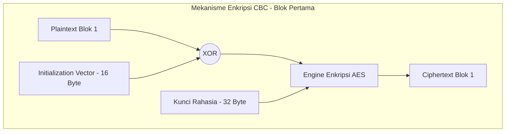

# Keamanan Data dengan AES-256-CBC

Meskipun jalur HTTPS telah mengamankan data di tengah jalan (*in transit*) dari pengalihan pihak ketiga, sistem Tugas Akhir ini menambahkan lapisan pertahanan kustom (**Application-Layer Encryption**) untuk mengamankan data transaksi sensitif (seperti kredensial Wi-Fi baru atau perintah mutasi konfigurasi aktuator) yang ditransmisikan melalui jalur WebSocket lokal, WebSerial, dan portal konfigurasi AP.

Implementasi enkripsi simetris ini menggunakan algoritma **AES-256-CBC** dengan skema **PKCS7 Padding**.

---

## 1. Konsep Dasar Keamanan AES-256-CBC

1.  **AES-256 (Advanced Encryption Standard)**
    Algoritma enkripsi simetris yang membagi data plaintext menjadi blok-blok tetap berukuran **16 byte (128 bit)**. Kunci keamanan yang digunakan adalah **256 bit (32 byte)**, memberikan tingkat kekuatan kriptografi standar tinggi. Kunci default didefinisikan secara statis:
    ```text
    "12345678901234567890123456789012"
    ```
2.  **Mode CBC (Cipher Block Chaining)**
    Setiap blok plaintext akan di-XOR dengan blok ciphertext hasil enkripsi sebelumnya sebelum dienkripsi. Dengan skema ini, dua blok plaintext yang identik akan menghasilkan ciphertext yang berbeda, mempersulit pola analisis data.
3.  **Initialization Vector (IV)**
    Karena blok pertama tidak memiliki ciphertext pendahulu, sistem memerlukan **IV** acak berukuran **16 byte** sebagai nilai XOR pembuka. IV harus unik dan acak pada setiap transaksi enkripsi baru.



---

## 2. Struktur Mekanisme PKCS7 Padding

AES beroperasi pada blok biner berukuran kelipatan pas **16 byte**. Jika plaintext asli tidak memenuhi kelipatan tersebut, byte tambahan (**padding**) akan disisipkan di akhir data dengan aturan: **nilai setiap byte padding yang ditambahkan adalah sama dengan jumlah byte padding itu sendiri**.

*   **Kasus Kurang 3 Byte (Contoh 13 Byte Plaintext)**:
    Sistem akan menambahkan 3 byte padding di akhir bernilai `0x03`.
    *   *Plaintext*: `[D A T A A S L I D A T A A]` (13 byte)
    *   *Padded*: `[D A T A A S L I D A T A A] [0x03] [0x03] [0x03]` (16 byte)
*   **Kasus Pas Kelipatan 16 Byte**:
    Sistem **wajib** menambahkan 1 blok padding penuh (16 byte) baru bernilai `0x10` (desimal 16). Hal ini dilakukan agar saat dekripsi, sistem tidak membuang data asli yang kebetulan berakhiran dengan nilai byte kecil yang menyerupai padding.

Di sisi penerima, setelah didekripsi, sistem akan memeriksa byte terakhir (misalnya bernilai `N`), memvalidasi apakah memang benar `N` byte terakhir bernilai `N`, lalu memotong byte-byte tersebut untuk mendapatkan data asli.

---

## 3. Komparasi Dual Implementasi Kriptografi C++

Sistem memiliki dua implementasi C++ yang disesuaikan dengan library tiap perangkat:

### A. Sisi Firmware Node (ESP8266) - BearSSL
Karena keterbatasan RAM bebas pada modul ESP8266 (~30 KB-40 KB), file [CryptoUtils.cpp](file:///home/dhimasardinata/Dokumen/ta/node/lib/NodeCore/support/CryptoUtils.cpp) dan [CryptoUtils.h](file:///home/dhimasardinata/Dokumen/ta/node/lib/NodeCore/support/CryptoUtils.h) dioptimalkan secara ketat:
*   **Engine BearSSL**: Menggunakan pustaka BearSSL (`bearssl/bearssl.h`) yang hemat memori. Konteks enkripsi/dekripsi dibungkus di dalam kelas `CryptoUtils::AES_CBC_Cipher`.
*   **Pencegahan Stack Overflow**: Konteks `br_aes_ct_cbcenc_keys` dan buffer kerja scratch dialokasikan pada memori **Heap** menggunakan penunjuk pintar `std::unique_ptr` untuk mencegah ledakan penggunaan memori pada Stack saat fungsi dipanggil.
*   **Daur Ulang Memori (Purge Memory under TLS Pressure)**:
    Protokol TLS/HTTPS BearSSL membutuhkan heap yang cukup. Di `node/include/config/constants.h`, guard TLS terlihat memakai `TLS_MIN_TOTAL_HEAP = 8000`, `TLS_MIN_SAFE_BLOCK_SIZE = 4096`, `TLS_RX_BUF_SIZE = 2048`, dan `TLS_TX_BUF_SIZE = 1024`. Pada saat inisiasi koneksi HTTPS cloud, fungsi `prepareTlsHeap()` di [ApiClient.Security.cpp](file:///home/dhimasardinata/Dokumen/ta/node/lib/NodeCore/api/ApiClient.Security.cpp#L41-L62) dapat memanggil:
    ```cpp
    CryptoUtils::releaseMainCipherScratch();
    CryptoUtils::releaseWsCipher();
    ```
    Langkah ini membebaskan buffer instansiasi cipher AES dari memori agar TLS memiliki cukup RAM bebas untuk proses jabat tangan (*handshake*) tanpa memicu crash *Out of Memory*.

### B. Sisi Firmware Gateway (ESP32) - mbedtls
Pada gateway ESP32, file [CryptoUtils.cpp](file:///home/dhimasardinata/Dokumen/ta/gateway/src/CryptoUtils.cpp) dan [CryptoUtils.h](file:///home/dhimasardinata/Dokumen/ta/gateway/include/CryptoUtils.h) memakai API kriptografi dari ESP-IDF/mbedtls:
*   **Engine mbedtls**: Memanfaatkan pustaka internal ESP-IDF `mbedtls/aes.h` dan `mbedtls/base64.h`.
*   **IV dari `esp_random()`**: Vektor IV dibuat dengan mengambil byte dari `esp_random()`.
*   **Buffer dinamis**: Implementasi gateway memakai `std::vector<uint8_t>` untuk buffer plaintext/ciphertext dan fungsi `mbedtls_base64_encode` / `mbedtls_base64_decode` untuk konversi Base64.

---

## 4. Format Payload Transmisi Data

Pesan terenkripsi dikirimkan dalam format teks string ringkas yang dipisahkan oleh tanda titik dua (`:`):

$$\text{Payload} = \text{Base64(IV)} : \text{Base64(Ciphertext)}$$

Penerima data cukup memisahkan string menggunakan fungsi `indexOf(':')`, melakukan dekode Base64 pada masing-masing substring ke dalam array byte biner, lalu menjalankan fungsi dekripsi AES.

---

## 5. Proteksi Serangan Replay (Timestamp Skew Window)

Untuk mencegah **Replay Attack** (di mana penyerang merekam data perintah terenkripsi, misal mutasi jadwal relay aktif, lalu mengirimkannya kembali di lain hari untuk menyabotase greenhouse), sistem menyisipkan **Unix Timestamp 4-byte** (format Big Endian) tepat di depan plaintext sebelum proses enkripsi.

```text
Struktur Plaintext = [Unix Timestamp (4-Byte)] + [Pesan Asli JSON]
```

### Prosedur Validasi Penerimaan:
1.  Penerima mendekripsi payload dan mengekstrak 4 byte pertama menjadi timestamp biner.
2.  Penerima mengambil waktu epoch saat ini ($t_{\text{sekarang}}$) dari jam sistem. Pada node, kode memakai `time(nullptr)` dan melewati cek skew jika waktu belum sinkron. Pada gateway, jam sistem dapat diisi dari RTC fisik, NTP, HTTP time, atau waktu modem sesuai jalur `RTCManager`.
3.  Sistem menghitung selisih waktu mutlak:
    $$\Delta t = |t_{\text{sekarang}} - t_{\text{payload}}|$$
4.  Penerima memvalidasi nilai tersebut terhadap **Skew Window** konfigurasi:
    *   **Strict Window**: `30 detik` (digunakan pada saat sinkronisasi ketat).
    *   **Soft Window (Default)**: `300 detik` (toleransi toleran jika jam RTC perangkat sedikit bergeser dari server).
    *   **Max Window**: `900 detik`.
5.  Jika $\Delta t$ melampaui batas skew window, data langsung dibuang secara sepihak dan dianggap tidak valid demi keamanan.

Lanjutkan ke halaman **[Integritas CRC32](./crc32.md)** untuk mempelajari bagaimana data pada memori fisik dan flash LittleFS dilindungi dari kerusakan biner.
