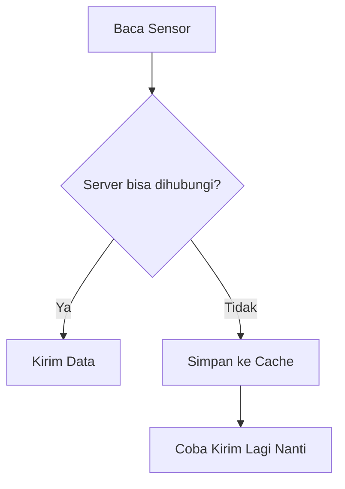

# Caching

Caching adalah menyimpan data sementara agar bisa dipakai lagi. Dalam IoT, caching sering dipakai saat jaringan tidak stabil.

## Contoh Caching Data Sensor

Jika node membaca sensor tetapi server tidak bisa dihubungi, node dapat menyimpan data sementara. Setelah jaringan pulih, data dapat dikirim ulang.

## Kenapa Caching Penting

Tanpa caching, data bisa hilang saat koneksi buruk. Pada penelitian, data hilang bisa mempengaruhi analisis.

## Risiko Caching

Caching juga punya risiko:

- storage penuh,
- data duplikat,
- urutan data berubah,
- data lama dikirim terlalu terlambat,
- data cache rusak,
- flash terlalu sering ditulis.

## Hal yang Harus Dijelaskan di File-by-File

Halaman file cache menjelaskan:

- format data cache,
- lokasi penyimpanan,
- batas jumlah data,
- kapan data ditulis,
- kapan data dikirim ulang,
- cara mencegah duplikasi,
- cara debugging jika cache bermasalah.

Kembali ke [Fondasi Sistem: IoT](./iot.md) atau lanjut ke arsitektur saat tersedia.
