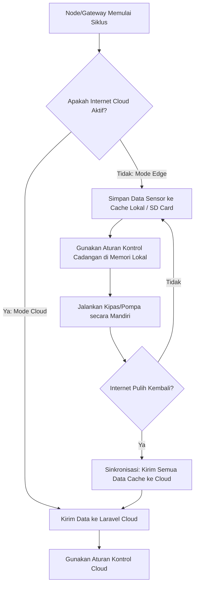

# Cloud dan Edge

Di manakah data sensor diolah dan di mana keputusan penyiraman anggrek diambil? Sistem Tugas Akhir ini menerapkan pendekatan **Hybrid: Cloud dan Edge Computing**.

Mari kita pahami perbedaan peran keduanya dan bagaimana sistem berpindah mode secara dinamis!

---

## Memahami Cloud vs Edge

* **Cloud Computing:** Semua pemrosesan data, database utama, dan visualisasi dashboard berada di server internet jarak jauh (dalam TA ini menggunakan server berbasis framework **Laravel**). Cloud memiliki kapasitas penyimpanan yang sangat besar dan dapat diakses dari mana saja menggunakan HP android atau laptop melalui koneksi internet.
* **Edge Computing:** Pemrosesan data dilakukan sangat dekat dengan fisik greenhouse, yaitu langsung di **Gateway ESP32** atau memori lokal **Node ESP8266**. Edge bertindak sangat cepat karena tidak terpengaruh oleh delay koneksi internet, sangat berguna ketika jaringan internet luar mati.

---

## Tiga Mode Kerja Sistem (`ConfigManager`)

Di dalam firmware node sensor dan gateway, kita memiliki konfigurasi mode operasi yang dikelola oleh `ConfigManager`. Pengguna dapat memilih salah satu dari tiga mode berikut:

| Mode | Cara Kerja | Kapan Digunakan |
|---|---|---|
| **Cloud-Only** | Perangkat harus selalu terhubung ke server Laravel cloud di internet. Semua data langsung dikirim ke cloud, dan aturan kontrol (jadwal/threshold) diambil langsung dari server cloud. | Ketika greenhouse memiliki koneksi internet fiber/seluler yang sangat stabil dan andal. |
| **Edge-Only** | Perangkat berjalan offline/lokal tanpa memerlukan internet sama sekali. Data disimpan di database lokal/SD card gateway, dan kontrol aktuator dikendalikan sepenuhnya oleh aturan yang disimpan di memori lokal. | Ketika greenhouse berada di pelosok yang tidak ada jangkauan sinyal internet luar, namun jaringan lokal Wi-Fi tetap berjalan. |
| **Auto (Hybrid / Fallback)** | Sistem akan mendeteksi koneksi internet secara berkala. Jika internet menyala, sistem bekerja seperti mode Cloud. Jika internet putus, sistem akan berpindah otomatis ke mode Edge untuk menjaga operasi greenhouse tetap aman. | Mode bawaan (default) yang direkomendasikan untuk menjamin keandalan sistem terhadap pemadaman internet mendadak. |

---

## Alur Fallback Mode Auto saat Internet Putus

Mekanisme peralihan otomatis (Auto Mode) berjalan dengan alur sebagai berikut:

### Mekanisme Sinkronisasi (Sync)
Ketika sistem kembali ke Mode Cloud setelah offline, **CacheManager** akan mulai membaca rekaman data sensor yang tersimpan di flash memory (LittleFS) satu per satu. Data-data historis ini dikirim kembali ke Laravel Cloud secara bertahap agar tidak membebani jaringan (*caching synchronization*), lalu rekaman yang sukses dikirim akan dihapus dari cache lokal.

Lanjutkan ke [REST API](./rest-api.md) untuk melihat daftar pintu komunikasi data yang disediakan oleh server Laravel Cloud untuk perangkat IoT kita!
