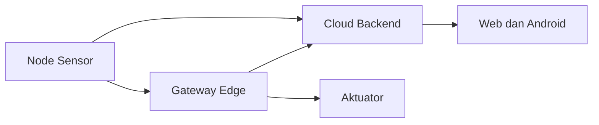

# Cloud dan Edge

Cloud berarti pemrosesan atau penyimpanan dilakukan di server jarak jauh. Edge berarti sebagian pemrosesan dilakukan dekat dengan perangkat, misalnya di gateway lokal.

## Cloud dalam Sistem Ini

Cloud berguna untuk:

- menyimpan data historis,
- menyediakan API,
- menampilkan dashboard dari internet,
- menyimpan jadwal dan threshold,
- menyediakan file OTA.

## Edge dalam Sistem Ini

Edge berguna untuk:

- tetap bekerja saat koneksi cloud bermasalah,
- mengambil data node lokal,
- menghitung atau menyaring data lokal,
- mengendalikan aktuator lebih dekat ke greenhouse.

## Mode Cloud, Edge, dan Auto

`goal.md` menyebut mode cloud, edge, dan auto. Penjelasan awal:

- cloud: perangkat mengandalkan server cloud,
- edge: perangkat mengandalkan jalur lokal/gateway,
- auto: perangkat memilih atau berpindah sesuai kondisi.

Detail implementasi mode harus diverifikasi di firmware node dan gateway.

## Diagram Konsep

Lanjutkan ke [REST API](./rest-api.md).
