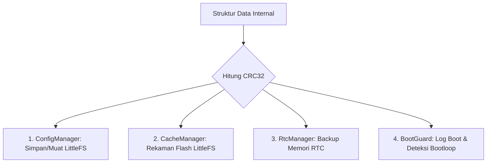

# Verifikasi Integritas Data dengan CRC32

Di dalam sistem embedded seperti node sensor ESP8266, kita sering berhadapan dengan media penyimpanan yang tidak stabil. Mati lampu mendadak saat perangkat sedang menulis data, degradasi sel memori flash, atau fluktuasi tegangan listrik dapat merusak data penting yang disimpan.

Untuk mendeteksi kerusakan data secara cepat dan andal, sistem kita menggunakan algoritma **CRC32 (Cyclic Redundancy Check 32-bit)**.

---

## Bagaimana CRC32 Bekerja?

CRC32 adalah algoritma *checksum* yang mengubah blok data berukuran apa saja menjadi nilai angka unik berukuran **4 byte (32-bit)**.

### 1. Polinomial Standar IEEE
Algoritma ini menggunakan pembagian matematika biner (polynomial division). Polinomial standar yang digunakan di sistem ini adalah **IEEE 802.3** dengan representasi bit-reversed (little-endian) bernilai:

$$\text{Polynomial} = \text{0xEDB88320}$$

Setiap byte dari data akan diumpankan ke dalam perhitungan biner ini secara beruntun. Jika ada satu bit saja dari data asli yang berubah (misalnya dari `0` menjadi `1` akibat interferensi listrik), nilai akhir CRC32 yang dihasilkan akan berubah total.

### 2. Optimasi Kecepatan dengan Lookup Table
Melakukan perhitungan pembagian biner bit-demi-bit pada mikro kontroler berkecepatan rendah sangat memakan waktu.

Oleh karena itu, file `Crc32.cpp` menggunakan **Lookup Table** berisi 256 entri konstanta pra-kalkulasi berukuran 32-bit (total **1 KB**). Dengan tabel ini, algoritma bisa memproses data byte-demi-byte (8 bit sekali jalan), mempercepat kalkulasi hingga 8 kali lipat.

### 3. Hemat RAM dengan Flash Storage (`PROGMEM`)
RAM ESP8266 sangat berharga. Menyimpan tabel 1 KB di RAM hanya untuk kalkulasi berkala adalah pemborosan.
* Firmware kita menyimpan lookup table tersebut di dalam memori Flash (ROM) menggunakan atribut `PROGMEM`.
* Tabel hanya dibaca ke RAM sementara per byte saat dibutuhkan.
* Jika kecepatan ekstrim diperlukan, compiler flag `CACHE_CRC_TABLE_IN_RAM` dapat diaktifkan untuk memindahkan tabel ke RAM, tetapi secara bawaan ia tetap di Flash demi efisiensi heap.

---

## Empat Kasus Penggunaan Utama di Codebase

Algoritma CRC32 diimplementasikan pada kelas `Crc32` (file `Crc32.cpp` & `Crc32.h`) dan menjadi fondasi utama keamanan data internal di 4 komponen:



### 1. ConfigManager (Validasi Konfigurasi LittleFS)
Pengaturan perangkat (token, URL server, mode kerja, dan interval) disimpan dalam file konfigurasi di LittleFS.
* Saat menyimpan konfigurasi, sistem menghitung CRC32 dari isi struktur konfigurasi dan menyimpannya bersama header file.
* Saat perangkat melakukan booting, `ConfigManager` membaca kembali struktur tersebut, menghitung ulang CRC32, dan mencocokkannya dengan CRC32 yang tersimpan.
* Jika nilainya berbeda (misalnya karena firmware baru mengubah struktur dari V3 ke V4, atau memori corrupt), sistem akan langsung mendeteksi ketidakcocokan ini, menolak data corrupt tersebut, dan memulihkan pengaturan ke nilai pabrik (*factory defaults*) untuk mencegah kegagalan booting.

### 2. CacheManager (Validasi Cache Sensor Lokal)
Ketika internet mati dalam Mode Auto, data sensor disimpan di memori flash lokal menggunakan filesystem **LittleFS**.
* Setiap blok data sensor yang disimpan dilengkapi dengan nilai checksum CRC32.
* Saat internet pulih dan sistem membaca cache untuk dikirim ke cloud, CRC32 diperiksa terlebih dahulu.
* Jika suatu blok cache terdeteksi corrupt, blok tersebut dilewati agar data rusak tidak terkirim ke Laravel Cloud dan merusak statistik grafik.

### 3. RtcManager (Validasi Memori RTC SRAM)
ESP8266 memiliki area memori kecil bernama RTC RAM (SRAM) yang tetap bertahan melewati restart biasa, tetapi hilang jika listrik mati total. Firmware node memakai area ini sebagai antrean kecil untuk data sensor offline, bukan sebagai siklus *deep sleep*.
* Setiap slot data sensor di RTC RAM punya magic marker dan CRC32.
* Saat node boot atau akan membaca antrean, `RtcManager` memvalidasi header dan record. Jika ada slot rusak, sistem mencoba melakukan recovery terbatas atau membuang slot corrupt agar antrean tetap aman dibaca.

### 4. BootGuard (Pencegahan Bootloop)
`BootGuard` bertindak sebagai sistem perlindungan darurat. Ia menyimpan jumlah crash dan alasan restart di RTC RAM.
* Log crash ini divalidasi dengan CRC32.
* Jika crash berulang, `BootManager` melakukan pemulihan bertahap seperti menghapus `/cache.dat`, format LittleFS pada level lebih parah, atau menahan boot normal. Aplikasi juga dapat masuk mode portal lokal jika crash count melewati batas aman.

---

## Contoh Kode Penggunaan Incremental
Kelas `Crc32` juga mendukung perhitungan bertahap (*incremental chaining*). Ini sangat berguna untuk menghitung CRC dari file besar yang tidak bisa dimuat sekaligus ke RAM:

```cpp
// Contoh menghitung CRC32 file secara bertahap
uint32_t crc = 0xFFFFFFFF; // Nilai awal standar
uint8_t buffer[64];

while (file.available()) {
    size_t len = file.read(buffer, sizeof(buffer));
    // Nilai crc sebelumnya dilewatkan sebagai parameter ketiga
    crc = Crc32::compute(buffer, len, crc);
}
// Hasil akhir di-XOR kembali
crc = ~crc;
```

Lanjutkan ke [Database](./database.md) untuk mempelajari bagaimana server menyimpan data sensor yang telah lolos verifikasi integritas dan keamanan!
