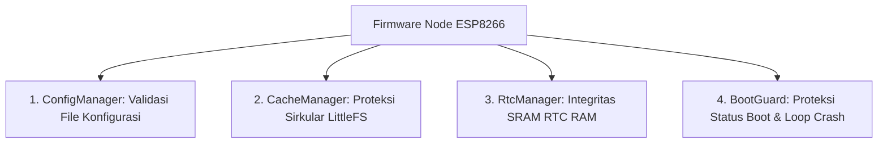

# Verifikasi Integritas Data dengan CRC32

Pada sistem nirkabel terdistribusi (*wireless sensor networks*) seperti node sensor berbasis ESP8266, data internal yang disimpan ke media penyimpanan rentan terhadap kerusakan. Kejadian pemadaman daya mendadak (*power cuts*) saat penulisan data sedang berlangsung, degradasi sel memori flash, atau interferensi tegangan dapat merusak konfigurasi sistem atau database lokal.

Untuk memastikan data yang dibaca tetap utuh sebelum digunakan dalam logika program, sistem menggunakan algoritma **CRC32 (Cyclic Redundancy Check 32-bit)**.

---

## 1. Spesifikasi Teknis Algoritma CRC32

Implementasi perhitungan CRC32 dikemas dalam kelas `Crc32` pada berkas [Crc32.cpp](file:///home/dhimasardinata/Dokumen/ta/node/lib/NodeCore/support/Crc32.cpp) dan [Crc32.h](file:///home/dhimasardinata/Dokumen/ta/node/lib/NodeCore/support/Crc32.h) dengan spesifikasi sebagai berikut:

### A. Polinomial Standar IEEE 802.3
Algoritma ini menggunakan pembagian polinomial biner standar **IEEE 802.3** dengan representasi bit terbalik (*bit-reversed / little-endian*) bernilai:

$$\text{Polynomial} = \text{0xEDB88320}$$

Setiap byte dari aliran data akan diumpankan ke dalam perhitungan biner. Jika ada satu bit saja dari data asli yang bergeser atau rusak, nilai akhir check-sum 32-bit yang dihasilkan akan berubah secara drastis.

### B. Optimasi Kecepatan via Lookup Table
Melakukan perhitungan pembagian polinomial bit-demi-bit pada mikrokontroler kecil memakan banyak siklus CPU. Karena itu, implementasi memakai tabel pencarian (*lookup table*) berisi 256 entri konstanta pra-kalkulasi berukuran 32-bit (total **1024 byte / 1 KB**). Tabel ini memungkinkan pemrosesan data dilakukan byte-demi-byte.

### C. Efisiensi RAM Menggunakan Flash Storage (`PROGMEM`)
RAM bebas (*heap*) pada ESP8266 sangat berharga. Menyimpan lookup table 1 KB di RAM hanya untuk perhitungan berkala tidak efisien.
*   **Atribut `PROGMEM`**: Tabel konstanta diletakkan di dalam memori Flash (ROM) menggunakan kata kunci `PROGMEM`.
*   **Instruksi `pgm_read_dword`**: Pembacaan data tabel dilakukan langsung dari flash secara dinamis per byte menggunakan makro `pgm_read_dword`.
*   **Compiler Flag**: Pengembang dapat mengaktifkan flag `CACHE_CRC_TABLE_IN_RAM` jika menginginkan tabel disalin penuh ke RAM demi kecepatan tinggi, namun secara bawaan tabel tetap berada di Flash demi menghemat heap.

---

## 2. Implementasi Perhitungan Incremental (Chaining)

Fungsi `Crc32::compute()` dirancang mendukung perhitungan bertahap (*incremental chaining*). Hal ini sangat berguna ketika menghitung checksum dari berkas log berukuran besar yang tidak dapat dimuat seluruhnya ke dalam keterbatasan RAM ESP8266:

```cpp
uint32_t compute(const void* data, size_t length, uint32_t initial_crc = 0);
```

### Logika Kode Sumber C++:
```cpp
uint32_t compute(const void* data, size_t length, uint32_t initial_crc) {
  if (!data || length == 0) {
    return initial_crc;
  }
  const uint8_t* bytes = static_cast<const uint8_t*>(data);
  uint32_t crc = initial_crc ^ 0xFFFFFFFFUL; // XOR awal

  for (size_t i = 0; i < length; ++i) {
    // Membaca tabel dari memori Flash (PROGMEM) secara dinamis
    crc = pgm_read_dword(&crc_table[(crc ^ bytes[i]) & 0xFF]) ^ (crc >> 8);
  }
  return crc ^ 0xFFFFFFFFUL; // XOR akhir
}
```

---

## 3. Penerapan Kritis CRC32 pada Sistem Node

Pada firmware Node, terdapat 4 modul utama yang menggunakan CRC32 sebagai penjamin validitas:



### 1. ConfigManager (Konfigurasi LittleFS)
Sebelum memuat berkas konfigurasi sistem dari flash LittleFS, sistem menghitung ulang CRC32 dari struktur konfigurasi yang dibaca dan membandingkannya dengan nilai CRC32 yang tersimpan di header konfigurasi. Jika tidak cocok (misalnya akibat modifikasi manual yang tidak lengkap atau kerusakan sektor flash), sistem akan menolak konfigurasi corrupt tersebut dan memulihkannya ke pengaturan pabrik (*factory defaults*) demi menjamin kestabilan boot.

### 2. CacheManager (Sirkular Database `/cache.dat`)
Dalam proses penyimpanan data sensor offline, data disimpan dalam baris record sirkular. Setiap record dilengkapi dengan 4 byte `PAYLOAD CRC` di akhir data. Jika terjadi mati listrik saat proses penulisan, sistem dapat mengidentifikasi letak data yang rusak menggunakan algoritma **CRC Salvaging**. Record yang rusak dilewati, sementara record dengan checksum valid diselamatkan (*salvaged*).

### 3. RtcManager (Memori SRAM Terisolasi)
Node menggunakan ESP8266 RTC user memory sebagai antrean cepat yang dapat bertahan melewati reset perangkat lunak selama perangkat tetap mendapat daya. Memory ini bukan penyimpanan permanen pengganti flash.
Setiap slot data di RTC RAM diverifikasi dengan CRC32:
```cpp
uint32_t calculateRecordCrc(const RtcRecordV2& record) {
  return Crc32::compute(&record, offsetof(RtcRecordV2, crc));
}
```
Jika nilai perhitungan berbeda dengan variabel `crc` bawaan record, data di RTC RAM dianggap rusak dan dibersihkan dari antrean sistem.

### 4. BootGuard (Pencegahan Bootloop)
`BootGuard` mencatat statistik jumlah crash beruntun dan penyebab reboot terakhir perangkat ke dalam RTC RAM. Untuk menghindari manipulasi atau korupsi memori SRAM akibat tegangan drop saat boot, seluruh struktur statistik ini dilindungi dengan CRC32. Jika crash berulang terdeteksi dengan checksum valid, sistem akan memicu tindakan pemulihan mandiri seperti memformat cache database LittleFS.

---

## 4. Pembatasan Arsitektur: Node-Only (ESP8266)

Perlu dicatat bahwa **implementasi CRC32 tingkat aplikasi ini hanya aktif pada sisi Node Sensor (ESP8266)**.

ESP32 Gateway tidak memakai pustaka `Crc32` kustom node ini. Konfigurasi gateway disimpan lewat NVS/Preferences, sedangkan log eksternal ditulis ke SD card melalui `SDCardLogger`. Pada source yang terlihat, jalur SD card tersebut tidak menambahkan envelope CRC32 aplikasi seperti `CacheManager` di node.

Lanjutkan ke bagian **[Desain Database](./database.md)** untuk mempelajari bagaimana data sensor yang valid disimpan secara permanen di server cloud.
