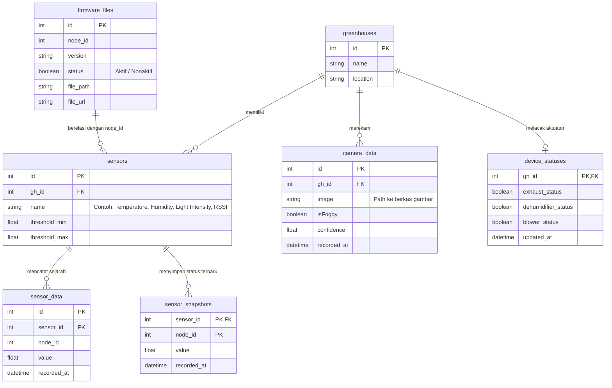

# Database (Skema MySQL dan Optimasi Kinerja)

Di mana semua data sensor yang dikirimkan oleh node bermuara? Bagaimana dashboard melacak kondisi greenhouse dari hari ke hari?

Jawabannya ada di **Database MySQL** server cloud kita. Database bertindak sebagai pusat penyimpanan terstruktur yang menampung seluruh konfigurasi, data historis lingkungan, hasil foto kamera, status sakelar, hingga daftar berkas update perangkat.

---

## Skema Tabel dan Relasi di Database

Berdasarkan implementasi kode pada Laravel backend (terutama file `ApiController.php` dan `OtaController.php`), database kita terdiri dari tabel-tabel utama berikut:

---

## Tabel-Tabel Utama dan Kegunaannya

### 1. `sensors`
Tabel ini mendefinisikan jenis sensor apa saja yang terpasang di setiap greenhouse beserta batas aman (*threshold*) operasi otomatis aktuator.
* **Kolom Penting:** `threshold_min` dan `threshold_max`.
* **Fungsi:** Jika suhu terdeteksi melewati `threshold_max` dari sensor "Temperature", maka gateway secara otomatis menyalakan kipas blower.

### 2. `sensor_data`
Tabel penampung data historis mentah. Setiap kali node sensor membaca data lingkungan (misal tiap 1 menit), data baru akan di-insert ke tabel ini.
* **Tantangan:** Karena data masuk secara terus-menerus, tabel ini akan tumbuh menjadi sangat besar (bisa mencapai ratusan ribu baris dalam beberapa bulan).

### 3. `sensor_snapshots` (Optimasi Kinerja)
Jika dashboard web ingin menampilkan nilai suhu terkini (gauge) dan kita mencarinya dengan melakukan pemindaian seluruh isi tabel `sensor_data` (*Full Table Scan*), server Laravel akan menjadi sangat lambat.
* **Solusi:** Kita membuat tabel khusus `sensor_snapshots` yang bertindak sebagai cache. Tabel ini hanya menyimpan **satu baris data terbaru** untuk setiap kombinasi `sensor_id` dan `node_id`.
* Setiap ada data sensor baru masuk ke `sensor_data`, server juga akan melakukan pembaruan (upsert/update) pada `sensor_snapshots`.
* Saat memuat dashboard utama, server cukup mengambil data dari `sensor_snapshots` secara instan tanpa perlu menyentuh tabel historis yang besar.

### 4. `camera_data`
Menyimpan riwayat analisis kabut dari modul kamera ESP32-Cam.
* Kolom `image` menyimpan path lokasi file gambar di server (misal `/storage/camera/camera_171628000.jpg`).
* Kolom `isFoggy` mencatat apakah citra tersebut dideteksi berkabut, sedangkan `confidence` mencatat persentase akurasi model AI pendeteksi kabut.

### 5. `device_statuses`
Mencatat status sakelar fisik aktuator (kipas blower, exhaust fan, dehumidifier) di greenhouse saat ini. Berguna agar pengguna di web/aplikasi HP tahu apakah kipas di greenhouse sedang berputar atau mati.

---

## Keamanan di Tingkat Database
Semua password akun pengguna disimpan menggunakan enkripsi hash satu arah (bcrypt). Akses database dilindungi oleh kredensial lingkungan (.env) yang ketat dan tidak diekspos ke publik. Port database MySQL juga dikonfigurasi agar hanya menerima koneksi lokal dari aplikasi Laravel (*localhost*), mencegah akses langsung dari luar server.

Lanjutkan ke [OTA Update](./ota-update.md) untuk melihat bagaimana sistem memperbarui firmware perangkat IoT melalui file biner yang disimpan di database!
