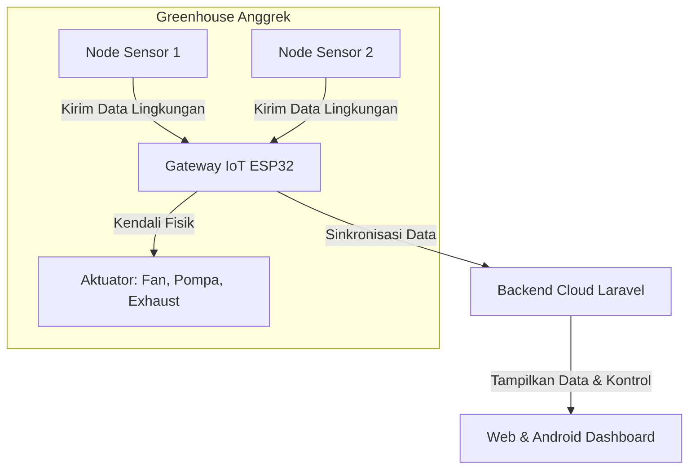

# IoT (Internet of Things)

Selamat datang di dasar paling utama dari sistem ini! Kamu mungkin sering mendengar istilah **IoT**, tetapi apa sebenarnya perannya di dalam greenhouse anggrek kita?

Secara sederhana, IoT (Internet of Things) adalah konsep di mana benda-benda fisik di sekitar kita "dihidupkan" dengan sensor, program, dan koneksi internet agar mereka bisa saling berkomunikasi, mengumpulkan data, dan mengambil keputusan otomatis.

Di dalam Tugas Akhir ini, konsep IoT tidak hanya sekadar teori, melainkan diwujudkan dalam bentuk perangkat keras nyata yang ditempatkan langsung di area greenhouse.

---

## Bagaimana IoT Bekerja di Greenhouse Ini?

Sistem greenhouse anggrek kita mengandalkan kerja sama erat antara dua jenis perangkat utama:

1. **Node Sensor (ESP8266)**
   Perangkat mikro kontroler kecil yang dipasang di berbagai titik greenhouse. Tugas utamanya adalah membaca kondisi udara secara berkala (seperti suhu, kelembapan, dan intensitas cahaya) menggunakan sensor fisik seperti SHT dan BH1750. Setelah dibaca, data diubah menjadi format digital untuk dikirimkan.

2. **Gateway IoT (ESP32)**
   Perangkat yang lebih kuat yang bertindak sebagai "polisi lalu lintas" dan otak lokal di greenhouse. Gateway menerima data dari node-node sensor, lalu memutuskan apakah harus menyalakan aktuator fisik (seperti kipas blower, pompa penyiram, exhaust fan, atau lampu grow light) berdasarkan aturan jadwal atau batas suhu/kelembapan yang telah ditentukan.

---

## Kenapa Kita Membutuhkan IoT?

Anggrek adalah tanaman yang sangat sensitif terhadap perubahan iklim mikro. Jika suhu terlalu panas atau udara terlalu kering, anggrek bisa layu atau gagal berbunga. Memantau secara manual dengan termometer dinding tentu sangat melelahkan dan rawan terlambat.

Dengan menerapkan sistem IoT ini, kita mendapatkan beberapa keuntungan besar:
* **Pemantauan Real-time 24/7:** Kondisi lingkungan dibaca setiap detik tanpa henti.
* **Tindakan Otomatis Instan:** Jika suhu terdeteksi melewati batas aman, kipas pendingin akan langsung menyala otomatis tanpa menunggu campur tangan manusia.
* **Penyimpanan Data Historis:** Semua riwayat suhu dan kelembapan disimpan rapi di database untuk analisis pertumbuhan anggrek di kemudian hari.

---

## Tantangan Nyata di Lapangan

Membuat sistem IoT yang siap pakai di greenhouse memiliki tantangan tersendiri yang harus diselesaikan di tingkat kode program:
* **Koneksi Terputus:** Wi-Fi di area pertanian seringkali tidak stabil. Program kita harus pintar menyimpan data sementara (caching) agar data tidak hilang saat internet mati.
* **Kerusakan Data:** Gangguan listrik atau induksi elektromagnetik dari pompa bisa merusak data yang dikirim. Kita memerlukan validasi checksum agar data yang rusak tidak mengacaukan keputusan sistem.
* **Keamanan:** Perintah kontrol kipas atau pompa tidak boleh disadap atau dimanipulasi oleh orang luar. Karena itu, jalur komunikasinya perlu dienkripsi secara memadai.

Lanjutkan ke [WSN (Wireless Sensor Network)](./wsn.md) untuk melihat bagaimana node-node ini membentuk jaringan nirkabel di dalam greenhouse!
