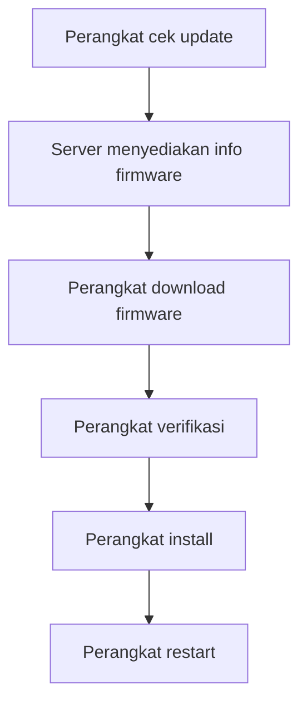

# OTA Update

OTA adalah Over The Air update. Artinya firmware perangkat dapat diperbarui melalui jaringan, bukan selalu lewat kabel USB.

## Kenapa OTA Penting

Perangkat IoT sering dipasang di lokasi yang tidak selalu mudah dijangkau. OTA membantu developer memperbaiki firmware atau menambah fitur tanpa membuka perangkat.

## Alur Konsep OTA

## Risiko OTA

OTA berisiko jika tidak aman:

- file firmware salah bisa membuat perangkat gagal boot,
- koneksi putus saat download,
- firmware palsu bisa berbahaya,
- storage perangkat bisa tidak cukup,
- versi firmware perlu dicatat.

## Hal yang Harus Didokumentasikan

Untuk file OTA, dokumentasi menjelaskan:

- URL update,
- cara cek versi,
- cara download,
- validasi keamanan,
- error handling,
- recovery jika gagal,
- log yang harus diperhatikan.

Lanjutkan ke [Caching](./caching.md).
