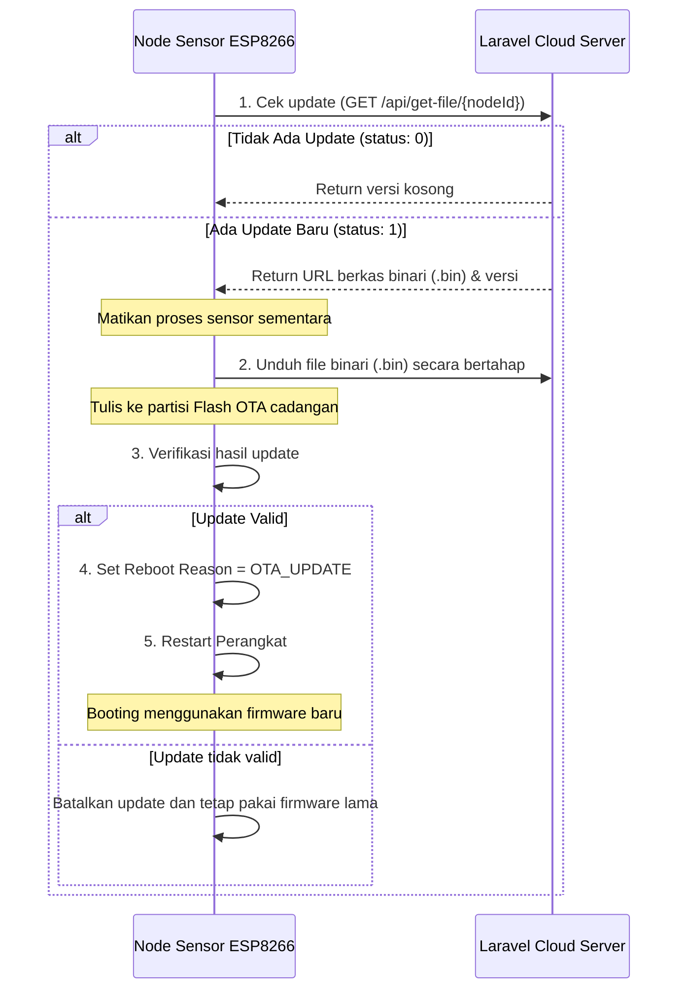

# Over-The-Air (OTA) Update dan Proteksi Bootloop

Dalam penerapan sistem IoT skala luas (seperti di greenhouse anggrek), perangkat keras seringkali dipasang di atap atau tempat tersembunyi yang sulit dijangkau kabel USB. Untuk memperbarui program (firmware), kita menggunakan fitur **OTA (Over-The-Air) Update** yang memungkinkan penginstalan firmware baru secara nirkabel melalui internet.

Namun, mengunduh dan menimpa kode program melalui udara memiliki risiko tinggi. Jika file firmware rusak di tengah jalan, mati lampu saat instalasi, atau firmware baru memiliki bug yang memicu crash berulang, perangkat bisa mati total (bricked).

Untuk menjamin keamanan, sistem kita dilengkapi dengan mekanisme **BootGuard (Proteksi Bootloop)**.

---

## Alur Kerja Proses OTA Update

Proses pembaruan firmware berjalan secara otomatis dengan tahapan sebagai berikut:



---

## Mekanisme Proteksi Bootloop dengan `BootGuard`

`BootGuard` adalah kelas pengawal booting (file `BootGuard.cpp` & `BootGuard.h`) yang memanfaatkan memori **RTC RAM** (memori kecil pada chip ESP8266 yang tidak hilang datanya selama proses reset perangkat keras, kecuali listrik mati total).

Mekanisme ini dirancang untuk mendeteksi kegagalan start dini (bootloop):

### 1. Pencatatan Crash Dini (Early Crash)
Ketika perangkat menyala:
* `BootGuard` akan membaca status booting dari RTC RAM dan langsung menaikkan nilai **Crash Count** (`incrementCrashCount()`).
* Integritas data `BootGuard` di RTC RAM dilindungi oleh **CRC32** untuk mencegah data palsu akibat fluktuasi listrik.

### 2. Tanda Stabil (Mark Stable)
* Jika perangkat berhasil menyala dan berjalan normal tanpa crash selama **60 detik**, program utama akan memicu `BootGuard::markStable()` lalu membersihkan counter boot.
* Fungsi ini akan me-reset *Crash Count* kembali ke angka `0`.

### 3. Masuk Safe Mode otomatis
* Jika firmware baru memiliki bug fatal yang membuatnya restart berulang sebelum melewati masa stabil, *Crash Count* tidak akan sempat di-reset.
* Pada booting berikutnya, nilai *Crash Count* akan bertambah lagi.
* Jika *Crash Count* melewati batas toleransi (**> 5 kali crash berturut-turut**), `BootGuard` akan memaksa perangkat untuk masuk ke **Safe Mode** saat booting berikutnya.

```
Start Booting
  └── Baca RTC RAM
       ├── CRC32 Rusak? ──> Reset Crash Count = 0
       └── CRC32 Valid?
            ├── Crash Count > 5? ──> Masuk SAFE MODE (Matikan fitur bermasalah, nyalakan Web Portal lokal)
            └── Crash Count <= 5 ──> Tambah Crash Count (+1) ──> Jalankan Firmware Normal
                                            │
                                            └── Berhasil menyala 60 detik? ──> Reset Crash Count = 0 (Stable)
```

---

## Apa yang Terjadi di Safe Mode?

Saat terpaksa masuk ke Safe Mode akibat bootloop:
1. Node sensor tidak menjalankan inisialisasi normal yang berisiko memicu crash lagi.
2. Node akan memancarkan sinyal Wi-Fi Access Point lokal darurat dan menyalakan **Local Web Portal** (Safe Mode Portal).
3. Pengembang dapat terhubung ke Wi-Fi lokal tersebut, membuka browser, memeriksa kondisi perangkat, lalu mengunggah firmware stabil melalui jalur pemulihan lokal yang tersedia.

Lanjutkan ke [Caching](./caching.md) untuk melihat bagaimana data disimpan secara aman saat koneksi internet offline!
