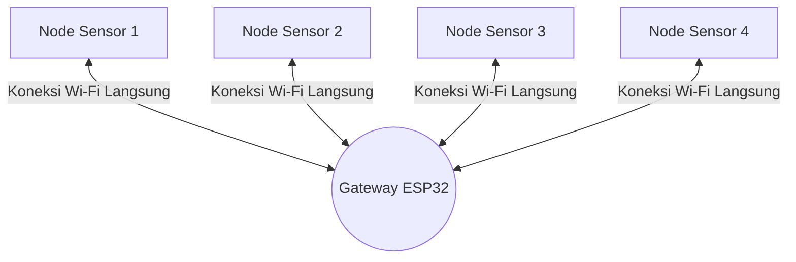

# Topologi Star

Sekarang mari kita bahas struktur atau peta hubungan antardevis dalam jaringan WSN kita. Sistem Tugas Akhir ini menggunakan pola hubungan yang disebut **Topologi Star** (Bintang).

---

## Apa itu Topologi Star?

Topologi Star adalah bentuk susunan jaringan di mana setiap perangkat (node sensor) terhubung langsung ke satu perangkat pusat yang bertindak sebagai pengatur utama (hub/pusat). Node sensor tidak saling berkomunikasi satu sama lain, melainkan semua data harus melewati perangkat pusat terlebih dahulu.

Di dalam greenhouse kita:
* **Perangkat Pusat (Pusat Bintang):** Adalah **Gateway IoT** berbasis **ESP32**. Gateway bertindak sebagai Wi-Fi Access Point (SoftAP) lokal yang memancarkan sinyal Wi-Fi khusus di area greenhouse.
* **Perangkat Ujung (Ujung Bintang):** Adalah **Node Sensor** berbasis **ESP8266**. Setiap node dikonfigurasi untuk terhubung langsung ke SSID Wi-Fi yang dipancarkan oleh Gateway ESP32 tersebut.

---

## Kenapa Memilih Topologi Star untuk Greenhouse?

 Pemilihan topologi ini didasarkan pada kebutuhan kepraktisan dan keterbatasan daya perangkat mikro kontroler:

1. **Beban Kerja Node Lebih Ringan**
   Node sensor ESP8266 tidak perlu memikirkan rute pengiriman data yang rumit atau membantu meneruskan data dari node lain (seperti pada topologi Mesh). Dalam kode saat ini, node berjalan terus di main loop: membaca sensor berkala, menjaga Wi-Fi, menyimpan antrean lokal, lalu mengirim data ke cloud atau gateway. Tidak ada pemanggilan mode *deep sleep* pada firmware node.

2. **Isolasi Kerusakan yang Baik**
   Jika salah satu node sensor mati listrik atau mengalami kerusakan perangkat keras, node-node lainnya tetap dapat bekerja mengirim data seperti biasa tanpa terganggu sama sekali.

3. **Kemudahan Troubleshooting**
   Jika terjadi masalah pengiriman data, kita dengan mudah bisa mempersempit masalah: apakah sinyal antara node bermasalah tersebut dengan gateway terhalang, atau gateway-nya yang mati?

---

## Risiko Utama: Single Point of Failure

Kelemahan terbesar dari Topologi Star adalah ketergantungan penuh pada perangkat pusat. Jika **Gateway ESP32** mati (misal karena mati lampu atau crash sistem), maka seluruh jaringan WSN akan lumpuh seketika karena tidak ada yang menampung data sensor.

Untuk mengatasi risiko ini, sistem kita dirancang agar mandiri di setiap ujungnya:
* **Antrean Lokal:** Jika cloud atau gateway belum dapat dijangkau, node tetap menyimpan data pembacaan ke RTC RAM dan LittleFS (`/cache.dat`) untuk dikirim ulang.
* **Watchdog / Recovery:** Gateway ESP32 memakai task watchdog, sedangkan node ESP8266 memakai `BootGuard` dan watchdog/restart untuk menangani freeze atau crash.

Lanjutkan ke [Cloud dan Edge](./cloud-edge.md) untuk melihat bagaimana data diolah, apakah langsung dikirim ke internet (cloud) atau diatur di tingkat lokal (edge)!
