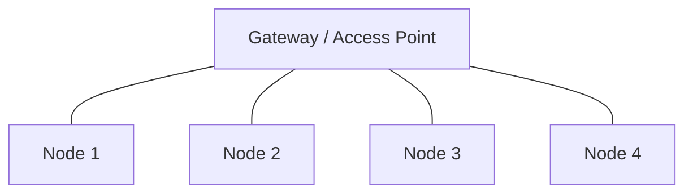

# Topologi Star

Topologi star adalah bentuk jaringan dengan satu pusat. Perangkat lain terhubung ke pusat tersebut.

## Contoh Sederhana

Dalam konteks greenhouse, pusat bisa berupa gateway atau access point Wi-Fi. Node sensor mengirim data melalui pusat tersebut.

## Kelebihan

- struktur mudah dipahami,
- gateway bisa menjadi pusat data lokal,
- troubleshooting lebih jelas,
- cocok untuk beberapa node sensor.

## Kekurangan

- jika pusat gagal, banyak node terdampak,
- jarak node ke pusat mempengaruhi kualitas sinyal,
- pusat bisa menjadi beban utama jaringan.

## Hubungan dengan Gateway

Gateway dapat berperan sebagai penghubung antara node lokal dan cloud. Gateway juga dapat menjalankan logika lokal jika cloud tidak tersedia, tergantung implementasi yang terverifikasi dari kode.

Lanjutkan ke [Cloud dan Edge](./cloud-edge.md).
