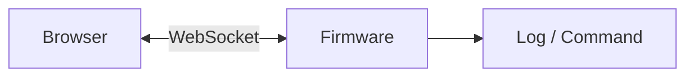

# WebSocket

WebSocket adalah jalur komunikasi dua arah yang dapat tetap terbuka antara client dan server/perangkat. Berbeda dengan request HTTP biasa yang selesai setelah response, WebSocket bisa dipakai untuk komunikasi berkelanjutan.

## Kegunaan dalam Sistem Ini

`goal.md` menyebut WebSocket lokal dan terminal gateway/node. Artinya WebSocket kemungkinan dipakai untuk:

- terminal lokal,
- log realtime,
- perintah dari dashboard lokal,
- status perangkat,
- komunikasi cepat antara browser dan firmware.

Detail pastinya harus diverifikasi di file firmware yang mengelola WebSocket.

## Contoh Alur Terminal

Browser dapat mengirim command. Firmware dapat mengirim output atau status kembali.

## Risiko WebSocket

WebSocket perlu diperhatikan dari sisi keamanan:

- siapa yang boleh terhubung,
- command apa yang boleh dikirim,
- apakah ada login atau token,
- apakah koneksi lokal dianggap aman,
- apakah input divalidasi.

Lanjutkan ke [HTTPS](./https.md).
