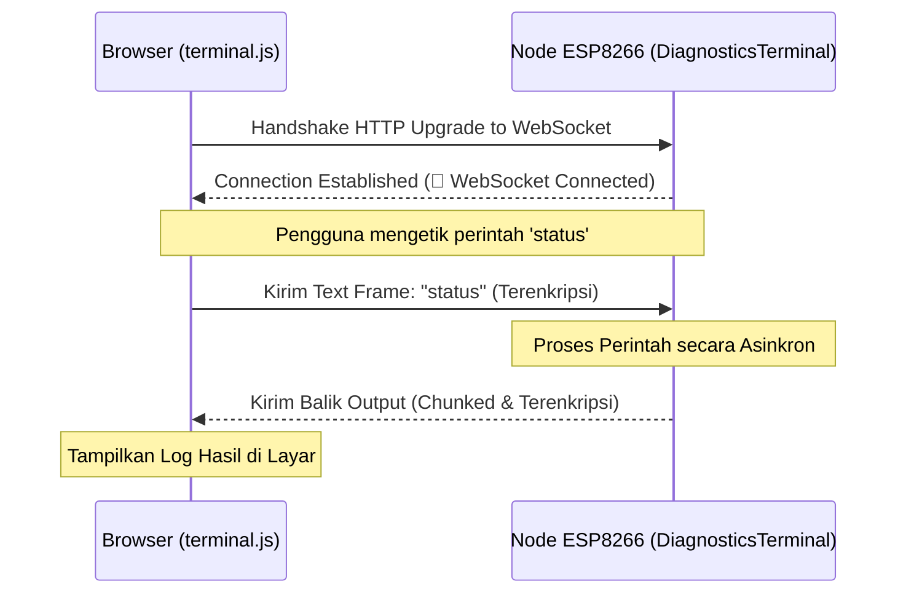

# WebSocket untuk Konsol Terminal Lokal

Selain REST API yang bersifat request-response searah, sistem kita juga memerlukan jalur komunikasi dua arah yang super cepat dan *real-time* untuk kebutuhan **debugging, pemantauan log langsung (real-time logs), dan konfigurasi manual** di tingkat lokal.

Jalur ini disediakan oleh protokol **WebSocket** (`/ws/terminal`) yang berjalan langsung di firmware node sensor ESP8266.

---

## Bagaimana Konsol Terminal Bekerja?

Ketika kamu membuka halaman dashboard lokal node (file `terminal.html` yang didukung oleh `terminal.js` di memori browser), browser akan membuka koneksi WebSocket persisten langsung ke IP lokal node sensor.

Setelah koneksi terjalin, browser bertindak seperti sebuah layar terminal (command line), dan node sensor bertindak sebagai server terminalnya (`DiagnosticsTerminal`).

---

## Tantangan Terbesar: Batasan RAM ESP8266

ESP8266 hanya memiliki sisa RAM bebas (*free heap*) yang sangat tipis, berkisar antara **15 KB hingga 20 KB** saja saat menjalankan Wi-Fi dan TLS. Mengirim data teks berukuran besar (seperti log booting lengkap atau bantuan command `/help` yang panjang) dapat langsung menghabiskan sisa memori dan memicu crash *Out of Memory* (OOM).

Untuk mengatasinya, sistem kita menerapkan aturan ketat pada kelas `DiagnosticsTerminal` dan modul `Utils.cpp`:

1. **WebSocket Chunking (`MAX_WS_PACKET_SIZE = 248`)**
   Setiap kali node ingin mengirimkan output teks yang panjang ke terminal browser, teks tersebut tidak langsung dikirim sekaligus. Teks dipotong-potong menjadi paket-paket kecil berukuran maksimal **248 byte**. Pemotongan ini memastikan buffer pengiriman soket tidak memakan alokasi heap yang besar.

2. **Yielding Non-Blocking**
   Saat mengirim data chunk secara berturut-turut, firmware memberikan waktu jeda mikro (`yield()`) ke sistem operasi ESP8266 agar fungsi sistem dasar (seperti menjaga koneksi Wi-Fi tetap hidup) bisa berjalan di sela-sela pengiriman log. Ini mencegah terpicunya restart akibat *Software Watchdog Timer (WDT)*.

3. **Optimasi Flash Memory (`PROGMEM`)**
   String pesan bantuan (`help`) dan template teks log statis disimpan di memori Flash (`PROGMEM`) menggunakan makro `F()` atau fungsi `ws_printf_P()`. Data hanya disalin ke RAM sedikit demi sedikit saat dikirim, bukan disimpan menetap di RAM.

---

## Enkripsi Jalur Terminal

Karena terminal dapat menerima perintah sensitif (seperti mengubah password Wi-Fi perangkat, melihat API key cloud, atau me-reset memori flash), komunikasi data WebSocket dienkripsi menggunakan fungsi `ws_send_encrypted`.

Hal ini memastikan:
* Peretas yang menyadap jaringan Wi-Fi lokal greenhouse tidak dapat membaca data log atau perintah konfigurasi yang sedang lewat.
* Hanya browser pengguna sah (yang memiliki skrip enkripsi pendukung di dashboard) yang bisa berinteraksi dengan terminal.

Lanjutkan ke [HTTPS](./https.md) untuk melihat bagaimana sistem mengamankan komunikasi data dari pembacaan sensor menuju server cloud jarak jauh!
