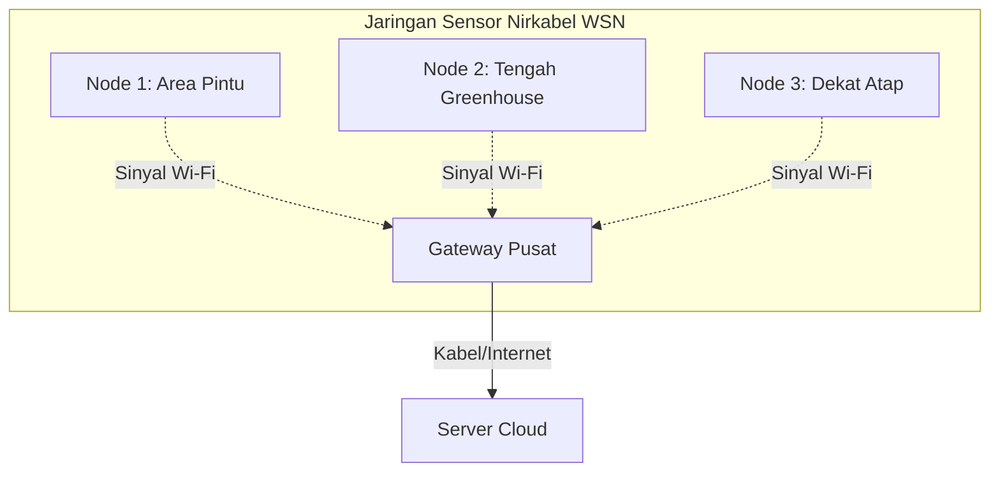

# WSN (Wireless Sensor Network)

Jika di halaman sebelumnya kita sudah tahu apa itu IoT, sekarang pertanyaannya: **bagaimana sensor-sensor di sudut greenhouse mengirim data ke gateway tanpa kabel berseliweran?**

Jawabannya adalah dengan membentuk **WSN (Wireless Sensor Network)** atau Jaringan Sensor Nirkabel.

---

## Apa itu WSN?

WSN adalah jaringan yang terdiri dari beberapa node sensor independen yang dipasang secara tersebar (spasial) untuk memantau kondisi fisik lingkungan secara nirkabel (wireless). Data dari setiap node akan melompat melalui udara menuju stasiun penerima pusat yang kita sebut dengan **Gateway**.

Di greenhouse kita, menaruh satu sensor saja di tengah ruangan tidaklah cukup. Sudut dekat pintu masuk mungkin lebih dingin dibanding sudut dekat atap transparan yang terpapar matahari langsung. Dengan WSN, kita bisa memasang beberapa node sensor kecil berbasis **ESP8266** untuk memantau variasi suhu secara detail di seluruh area greenhouse.

---

## Parameter Kualitas Jaringan (QoS) yang Diuji

Karena data dikirim melalui udara menggunakan sinyal Wi-Fi (2.4 GHz), jaringan ini sangat rentan terhadap gangguan. Tanaman anggrek yang rimbun, kelembapan udara tinggi di dalam greenhouse, serta dinding kaca/plastik uv dapat meredam kekuatan sinyal Wi-Fi.

Oleh karena itu, dalam Tugas Akhir ini kita menguji dan mengukur performa jaringan menggunakan parameter **QoS (Quality of Service)** berikut:

1. **RSSI (Received Signal Strength Indicator)**
   Diukur dalam satuan **dBm** (desibel-miliwatt). Nilai RSSI menunjukkan seberapa kuat sinyal Wi-Fi yang diterima oleh perangkat. Semakin mendekati angka `0` (misalnya `-40 dBm`), sinyal semakin kuat. Jika nilai RSSI turun di bawah `-80 dBm`, koneksi akan mulai putus-nyambung.

2. **Delay (Latency)**
   Waktu tempuh (biasanya dalam satuan milidetik atau **ms**) dari saat data sensor dikirim oleh node hingga sukses diterima oleh penerima. Delay yang rendah sangat penting agar kontrol aktuator darurat dapat merespons dengan cepat.

3. **Throughput**
   Kecepatan transfer data aktual yang berhasil dikirim melalui jaringan dalam kurun waktu tertentu (diukur dalam **kbps** atau **Mbps**). Walaupun data sensor berukuran kecil, throughput yang stabil memastikan tidak ada penumpukan antrean data.

4. **Packet Loss / Data Loss**
   Persentase jumlah paket data yang gagal sampai ke tujuan dibandingkan dengan seluruh paket yang dikirim. Jika *packet loss* tinggi, data monitoring di dashboard akan terlihat sering bolong-bolong atau terlambat diperbarui.

---

## Bagaimana Sistem Mengatasi Gangguan WSN?

Jika sinyal Wi-Fi drop dan terjadi *packet loss*, firmware node ESP8266 tidak boleh langsung menyerah dan membiarkan data terbuang begitu saja. Sistem kita dilengkapi dengan mekanisme pertahanan:
* **Retry Logic:** Mencoba mengirim ulang data beberapa kali jika pengiriman pertama gagal.
* **Local Storage Caching:** Jika jaringan benar-benar mati total, data sensor akan disimpan sementara di memori flash lokal node dan dikirimkan secara otomatis begitu koneksi Wi-Fi pulih kembali.

Lanjutkan ke [Topologi Star](./topologi-star.md) untuk melihat bagaimana pola hubungan komunikasi antara node sensor dan gateway diatur di dalam jaringan!
