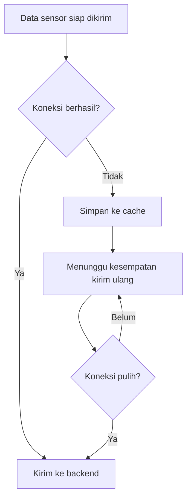

# Alur Caching

Caching menjaga data agar tidak langsung hilang saat jaringan gagal.

## Alur Konsep

## Kenapa Penting

Pada greenhouse, data historis penting untuk analisis. Jika koneksi cloud bermasalah dan data langsung dibuang, laporan dan dashboard bisa kehilangan catatan penting.

## Hal yang Harus Diverifikasi

- lokasi cache,
- format record,
- batas jumlah record,
- urutan pengiriman ulang,
- cara menghapus record yang berhasil dikirim,
- cara mencegah data duplikat,
- cara menangani file cache rusak,
- dampak flash write pada perangkat embedded.

## File yang Kemungkinan Terkait

- `node/lib/NodeCore/storage/CacheManager.*`,
- `node/lib/NodeCore/api/ApiClient.Queue*`,
- `node/lib/NodeCore/commands/CacheStatusCommand.*`,
- `node/lib/NodeCore/commands/ClearCacheCommand.*`.

Lanjutkan ke [Alur Keamanan](./alur-keamanan.md).
