# Alur Caching dan Sinkronisasi Data Offline

Ketika node sensor terpasang di area perkebunan anggrek, gangguan jaringan Wi-Fi lokal atau putusnya koneksi internet ke cloud adalah hal biasa. Tanpa penanganan khusus, data sensor saat jaringan mati akan menguap begitu saja, mengurangi akurasi hasil analisis Tugas Akhir.

Halaman ini membahas bagaimana sistem mendeteksi kegagalan koneksi, menyimpan data di cache internal, dan mengunggahnya kembali secara otomatis saat jaringan pulih.

---

## Diagram Alur Caching & Sinkronisasi

Alur kerja caching lokal terbagi menjadi dua skenario utama: **Penyelamatan Offline** dan **Sinkronisasi Online**.

```mermaid
flowchart TD
    %% Skenario A: Penyelamatan Offline
    subgraph Offline [Skenario A: Penyelamatan Offline]
        Read[1. Baca Sensor] --> Create[2. Bentuk record sensor]
        Create --> Persist[3. Panggil persistEmergencyRecord]
        Persist --> RAM{4. RTC RAM masih cukup?}
        RAM -->|Belum| WriteRAM[Tulis ke SRAM RTC]
        RAM -->|Ya / RTC gagal| WriteFlash[5. Tulis ke LittleFS /cache.dat]
        WriteFlash --> UpdateHead[6. Geser indeks head & tandai header dirty]
    end

    %% Skenario B: Sinkronisasi Online
    subgraph Online [Skenario B: Sinkronisasi Online]
        Timer[7. Timer cacheSendTimer] --> CheckNet{8. Wi-Fi tersambung dan NTP siap?}
        CheckNet -->|Sukses| PopCache[9. handleUploadCycle]
        PopCache --> ReadQueue[10. Baca record tertua dari RTC atau LittleFS]
        ReadQueue --> PostCloud[11. HTTP POST ke Cloud atau Gateway]
        PostCloud --> Ack{12. HTTP 2xx?}
        Ack -->|Ya| AdvanceTail[13. Pop record dari sumber antrean]
        Ack -->|Tidak| StopSync[Hentikan Sinkronisasi, Coba Nanti]
    end
```

---

## Penjelasan Langkah Detail

### 1. Pembuatan Record Sensor
Pada interval `DATA_UPLOAD_INTERVAL_MS`, `ApiClient` membuat record dari nilai sensor terbaru, waktu, dan RSSI. Record ini tidak langsung dibuang ketika jaringan buruk; record disimpan ke antrean lokal terlebih dahulu.

### 2. Penyimpanan ke RTC RAM dan LittleFS
Kode program memanggil jalur `persistEmergencyRecord`:
* Jika RTC RAM masih punya ruang, data disimpan sebagai slot `RtcManager`.
* Jika RTC RAM penuh atau gagal ditulis, data ditulis ke memori Flash `/cache.dat` melalui filesystem **LittleFS**.
* Pada LittleFS, setiap record punya magic marker, panjang data, payload, dan CRC32 payload. Header `CacheManager` juga dilindungi CRC32.

### 3. Pengecekan Koneksi Berkala (Connection Polling)
Selama masa offline, node sensor tetap merekam data ke dalam antrean FIFO (First-In, First-Out). Secara berkala, `cacheSendTimer` di main loop firmware mencoba mengirim record tertua kembali, selama Wi-Fi tersambung dan kondisi runtime aman.

### 4. Proses Sinkronisasi bertahap (Syncing / Flush Loop)
Begitu upload berjalan sukses, proses sinkronisasi dimulai:
* Fungsi `handleUploadCycle()` membaca record tertua dari RTC RAM terlebih dahulu, lalu dari LittleFS jika RTC kosong.
* Sistem membaca data paling tua yang berada di indeks `tail` pada file `/cache.dat` untuk antrean LittleFS.
* Data tersebut dikirim ke server cloud.
* Jika server atau gateway membalas `HTTP 2xx`, node melakukan `pop` pada sumber record tersebut. Untuk LittleFS, pointer `tail` bergeser dan `cacheHeader.size` berkurang.
* Jika upload gagal, record tetap berada di antrean dan retry berikutnya memakai backoff.

Lanjutkan ke **[Alur OTA](./alur-ota.md)** untuk mempelajari bagaimana file pembaruan firmware didistribusikan ke perangkat!
