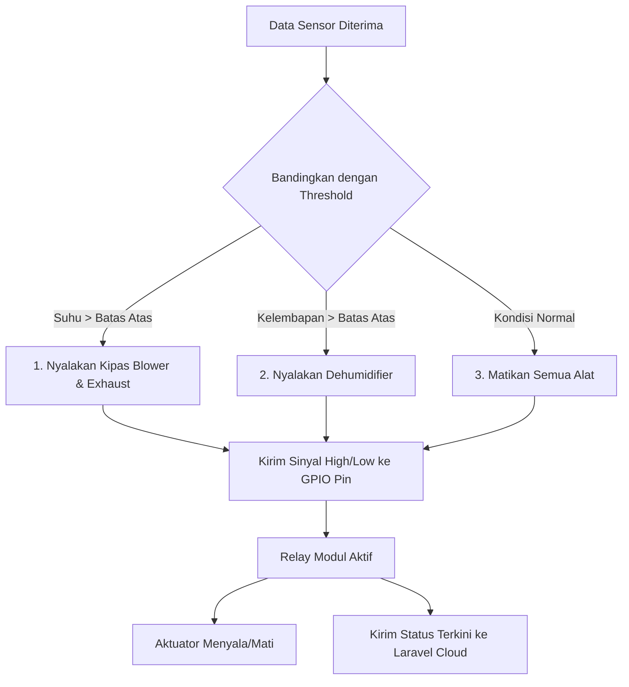

# Alur Data: Dari Gateway IoT Ke Relay Aktuator Greenhouse

Data sensor yang terkumpul tidak hanya berguna untuk dilihat sebagai grafik, tetapi juga untuk mengambil tindakan fisik nyata. Di sinilah peran **Gateway IoT (ESP32)** sebagai pengambil keputusan lokal (*Local Decision Engine*).

Halaman ini menjelaskan alur bagaimana gateway mengevaluasi kondisi iklim mikro greenhouse dan menerjemahkannya menjadi sinyal listrik untuk menyalakan/mematikan alat-alat aktuator.

---

## Siklus Kontrol Loop Lokal (Loop Evaluasi)

Gateway terus-menerus menjalankan loop pengawasan tertutup (*closed-loop control*):

---

## Logika Kontrol dan GPIO Pinout

Gateway mengendalikan perangkat listrik (AC 220V atau DC 12V) menggunakan modul **Relay Sakelar** yang dihubungkan langsung ke pin input-output fisik (GPIO) pada papan ESP32:

### 1. Kontrol Suhu Tinggi (Kipas Blower & Exhaust)
* **Kondisi:** Jika sensor suhu yang dikirim node melaporkan nilai di atas `threshold_max` (misal > 30°C).
* **Aksi:** Gateway mengirimkan sinyal logika `LOW` (jika relay active-low) ke pin GPIO kipas blower dan exhaust.
* **Tujuan:** Menarik udara dingin masuk dan mengeluarkan udara panas keluar dari greenhouse untuk menurunkan suhu ruangan anggrek.

### 2. Kontrol Kelembapan Tinggi (Dehumidifier)
* **Kondisi:** Jika kelembapan udara terdeteksi terlalu basah (melebihi batas atas, misal > 85% RH) yang dapat memicu pertumbuhan jamur pada anggrek.
* **Aksi:** Gateway mengaktifkan relay dehumidifier melalui pin GPIO yang terhubung.
* **Tujuan:** Mengurangi uap air berlebih di dalam greenhouse.

### 3. Sinkronisasi Status ke Cloud
Setiap kali status sakelar fisik berubah (misal dari mati ke nyala), Gateway mengirimkan HTTP POST berisi status aktuator terkini ke URL `DEVICE_STATUS_POST_URL`. Pada konfigurasi gateway saat ini, URL tersebut mengarah ke `/api/device_status` dan diproses oleh `ApiController@postDeviceStatus`. Hal ini memperbarui tabel `device_statuses` di database cloud, sehingga ikon kipas di web dashboard pengguna ikut sinkron dengan kondisi relay fisik.

---

## Prioritas Kontrol: Otomatis vs Manual (Cloud Override)

Sistem ini mendukung dua mode prioritas kontrol:

1.  **Mode Otomatis (Default):**
    Gateway mengambil keputusan murni berdasarkan perbandingan sensor lokal dengan parameter threshold yang diunduh dari cloud.
2.  **Mode Manual (Cloud Override):**
    Jika pengguna menekan tombol "Nyalakan Kipas" secara manual di website/aplikasi Android:
    * Server Laravel akan mengirimkan request perubahan status aktuator langsung ke Gateway.
    * Gateway akan mendengarkan perintah manual ini, mengabaikan pembacaan threshold sensor lokal sementara waktu, dan langsung mengubah logika pin GPIO sesuai permintaan pengguna.

Lanjutkan ke **[Alur Caching](./alur-caching.md)** untuk melihat bagaimana data diselamatkan jika koneksi internet terputus total!
