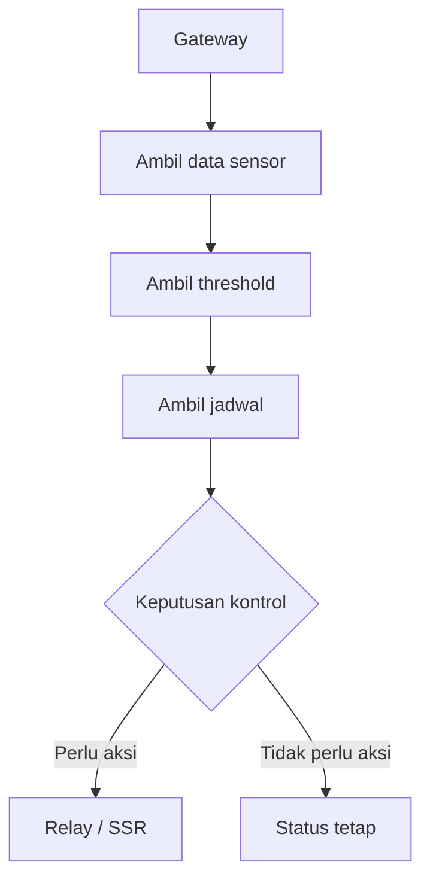

# Alur Gateway ke Aktuator

Gateway berperan dekat dengan aktuator. Aktuator adalah perangkat yang melakukan aksi fisik, seperti relay, SSR, fan, exhaust, atau dehumidifier.

## Alur Konsep

## Input Keputusan

Keputusan kontrol dapat memakai beberapa input:

- data sensor terbaru,
- rata-rata sensor,
- threshold,
- jadwal,
- mode sistem,
- status perangkat,
- kondisi jaringan.

## Risiko

Karena aktuator punya efek fisik, error di bagian ini harus dianggap penting. Risiko yang perlu dicatat:

- relay menyala saat tidak seharusnya,
- relay tidak menyala saat dibutuhkan,
- threshold salah,
- jadwal salah,
- data sensor tidak valid,
- gateway kehilangan koneksi,
- perintah kontrol ganda atau bertabrakan.

## File yang Kemungkinan Terkait

- `gateway/src/RelayController.cpp`,
- `gateway/src/GatewayControlState.cpp`,
- `gateway/src/SensorDataManager.cpp`,
- `gateway/include/ThresholdValidation.h`,
- `gateway/include/ScheduleValidation.h`.

Detail logika prioritas threshold dan jadwal dibahas dari source yang mengatur kontrol.

Lanjutkan ke [Alur Web dan Android](./alur-web-dan-android.md).
