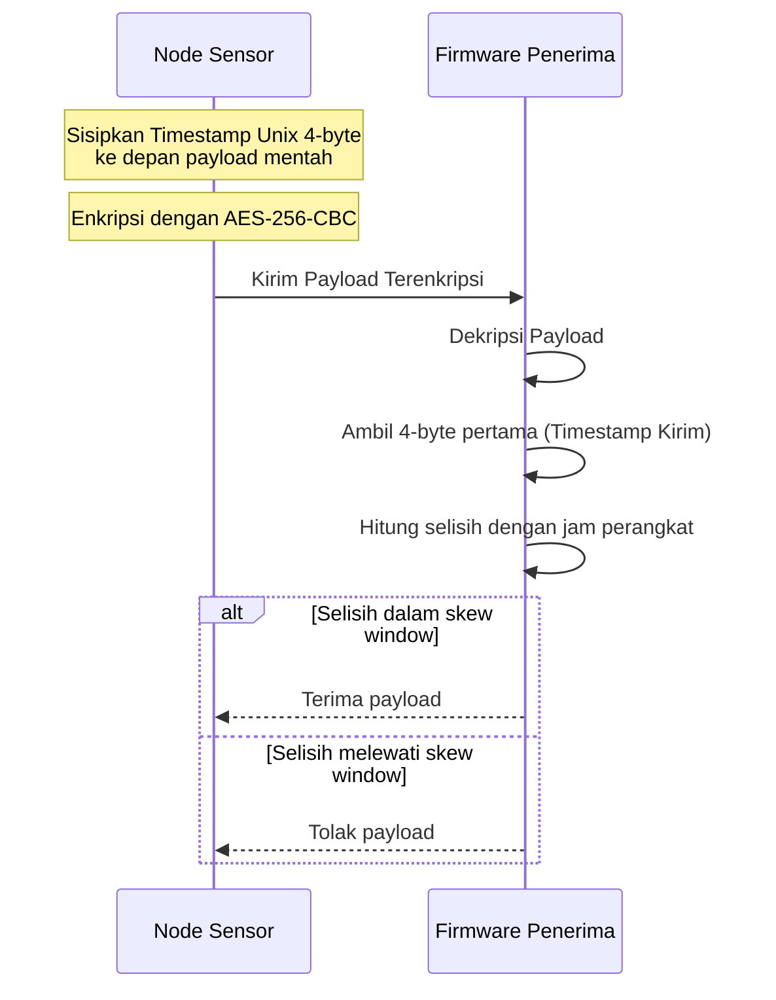

# Alur Keamanan Berlapis

Keamanan adalah salah satu aspek paling krusial dalam sistem IoT nirkabel. Tanpa sistem perlindungan yang memadai, pihak luar yang tidak bertanggung jawab dapat menyadap data greenhouse, memalsukan pembacaan sensor, hingga mengirimkan perintah palsu untuk merusak tanaman (misal menyalakan pompa air terus-menerus hingga banjir).

Sistem Tugas Akhir ini menerapkan **Keamanan Berlapis (Multi-layered Security)** dari tingkat jaringan hingga aplikasi.

---

## Tiga Lapisan Keamanan Utama

Berikut adalah arsitektur keamanan berlapis yang kita gunakan:

```
[ Data / Perintah ]
        │
        ▼
 1. APLIKASI (AES-256-CBC) ──> Dipakai pada jalur lokal/terminal tertentu
        │
        ▼
 2. PROTOKOL (Timestamp)   ──> Validasi replay saat payload AES didekripsi oleh firmware
        │
        ▼
 3. JARINGAN (TLS/HTTPS)    ──> Jalur cloud dibungkus SSL/TLS (BearSSL)
        │
        ▼
[ Firmware / Laravel / Gateway ]
```

---

## Penjelasan Lapisan Keamanan

### 1. Keamanan Jalur Jaringan (Transport Layer Security - TLS/HTTPS)
Pengiriman data dari node sensor ke cloud melewati protokol **HTTPS**:
* Menggunakan library **BearSSL** di sisi mikrokontroler untuk melakukan proses jabat tangan (*handshake*) TLS.
* Mencegah serangan penyadapan di tengah jalan (*Man-In-The-Middle / MITM Attack*).
* Token upload dikirim lewat header `Authorization: Bearer ...` ketika token tersedia, bukan lewat URL terbuka.

### 2. Enkripsi Data Aplikasi (Application Layer - AES-256-CBC)
Kode node juga memiliki enkripsi aplikasi **AES-256-CBC** di `CryptoUtils`. Namun, penggunaannya harus dibaca sesuai jalur:
* **Kunci 256-bit:** Menggunakan kunci simetris yang sama pada pengirim dan penerima yang mendukung jalur AES tersebut.
* **PKCS7 Padding:** Memastikan ukuran data selalu berkelipatan 16 byte (ukuran blok standar AES).
* **Format Pengiriman:** Data dikirim dalam format teks Base64 aman yang digabung dengan tanda titik dua: `Base64(IV):Base64(Ciphertext)`. IV (Initialization Vector) acak memastikan payload terenkripsi selalu berbeda setiap kali dikirim, meskipun isi sensornya sama persis.
* **Batas Fakta Repo:** Endpoint cloud `ApiController::saveSensorData` yang ada di repo ini menerima JSON biasa dan tidak melakukan dekripsi AES. AES dipakai pada jalur firmware/lokal tertentu, misalnya payload gateway lokal yang diberi prefix `ENC:` dan komunikasi terminal terenkripsi.

### 3. Proteksi Serangan Putar Ulang (Replay Attack Protection)
Serangan *Replay Attack* terjadi ketika paket terenkripsi yang valid direkam lalu dikirim ulang di waktu lain.

Untuk menangkal ini, kita menggunakan verifikasi **Timestamp Skew**:



* Setiap enkripsi payload selalu diawali dengan menyisipkan **Unix Timestamp 4-byte** (dalam format big-endian) yang mencatat detik tepat saat data dibuat.
* Setelah firmware mendekripsi data, firmware membaca timestamp tersebut dan membandingkannya dengan jam perangkat.
* Batas replay di kode node adalah `WS_REPLAY_SKEW_SEC_STRICT` 30 detik secara default, dengan mode lebih longgar sampai batas maksimum 900 detik. Ini bukan validasi 15 detik di Laravel cloud.

Lanjutkan ke **[Alur Web dan Android](./alur-web-dan-android.md)** untuk melihat bagaimana data yang aman ini ditampilkan kepada pengguna akhir!
