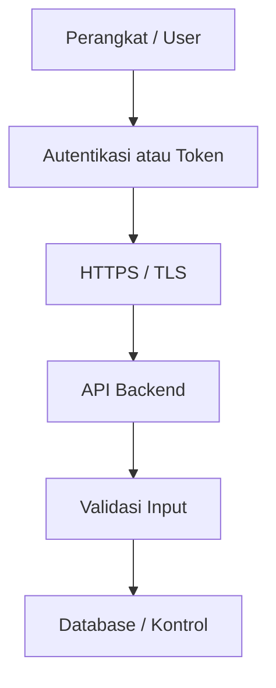

# Alur Keamanan

Keamanan sistem mencakup perlindungan komunikasi, akses, data, dan update firmware.

## Lapisan Keamanan

## Area yang Perlu Diperhatikan

- token perangkat,
- login pengguna,
- HTTPS/TLS,
- AES-256-CBC jika dipakai,
- WebSocket command,
- OTA firmware,
- upload/download file firmware,
- private key atau sertifikat dev,
- validasi request backend,
- XSS atau injection di frontend.

## Prinsip Dokumentasi Keamanan

Dokumentasi boleh menjelaskan fungsi file keamanan, tetapi tidak boleh menyalin rahasia seperti private key, token produksi, atau credential.

Jika ada file yang tampak seperti private key, dokumentasikan keberadaan dan risikonya, bukan isi rahasianya.

## File yang Kemungkinan Terkait

- `node/lib/NodeCore/security/`,
- `node/lib/NodeCore/support/CryptoUtils.*`,
- `gateway/src/CryptoUtils.cpp`,
- `gateway/include/root_ca.h`,
- `node/include/generated/certs.h`,
- `node/tools/certs/`,
- `web/*Controller.php`.

Detail keamanan harus diverifikasi dari kode dan konfigurasi nyata.

Kembali ke [Overview Arsitektur Sistem](./overview.md).
