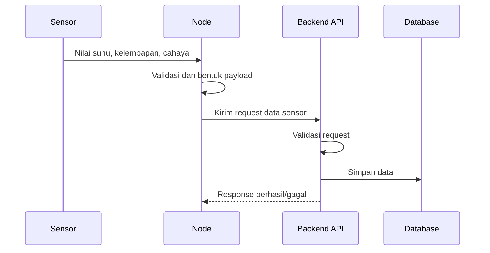

# Alur Node ke Cloud

Alur node ke cloud menjelaskan bagaimana data sensor dari perangkat lapangan bisa sampai ke backend dan database.

## Alur Konsep

## Tahap Penting

1. Node membaca sensor.
2. Node membentuk data yang siap dikirim.
3. Node memilih endpoint cloud.
4. Backend menerima request.
5. Backend memvalidasi data.
6. Database menyimpan data.
7. Node menangani response.

## Risiko

- sensor gagal dibaca,
- Wi-Fi putus,
- HTTPS gagal,
- token salah,
- server tidak merespons,
- payload tidak sesuai,
- database gagal menyimpan,
- data perlu masuk cache.

## File yang Kemungkinan Terkait

Berdasarkan inventory, file yang kemungkinan terkait ada di:

- `node/lib/NodeCore/api/`,
- `node/lib/NodeCore/sensor/`,
- `node/lib/NodeCore/storage/`,
- `web/*Controller.php`.

Detail pastinya harus dibuktikan saat file-by-file.

Lanjutkan ke [Alur Node ke Gateway](./alur-node-ke-gateway.md).
