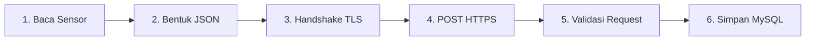

# Alur Data: Node Sensor Ke Laravel Cloud (HTTPS)

Bagaimana sebuah data fisik seperti suhu udara di greenhouse diubah menjadi angka grafik di dashboard web yang bisa Anda akses dari mana saja?

Halaman ini membahas alur perjalanan data dari **Node Sensor (ESP8266)** menuju **Laravel Cloud Server** menggunakan protokol **HTTPS**. Pada jalur cloud yang ada sekarang, payload sensor dikirim sebagai JSON biasa di dalam koneksi TLS; enkripsi AES dipakai pada jalur lokal/terminal tertentu, bukan pada endpoint Laravel `saveSensorData`.

---

## Urutan Alur Perjalanan Data

Perjalanan data dari tanah lapang hingga ke database cloud dibagi menjadi 6 tahap utama:



### 1. Pembacaan Sensor (Sensor Acquisition)
Sensor dibaca berkala oleh `SensorManager`, lalu record upload dibuat pada interval `DATA_UPLOAD_INTERVAL_MS` (default pabrik 10 menit, dapat diubah dari konfigurasi):
* **Suhu & Kelembapan:** SHT sensor melalui bus I2C.
* **Intensitas Cahaya:** BH1750 (Lux).
* **Kekuatan Sinyal:** RSSI (dBm) dari modul Wi-Fi ESP8266.

### 2. Pembentukan Payload JSON
Nilai sensor disusun menjadi JSON oleh helper upload firmware:
```json
{
  "gh_id": 1,
  "node_id": 1,
  "temperature": 27.4,
  "humidity": 72.1,
  "light_intensity": 1042,
  "rssi": -61,
  "recorded_at": "2026-05-21 09:30:00"
}
```

Payload ini juga disimpan ke antrean lokal (`RtcManager` lalu fallback `CacheManager`) agar tidak hilang jika upload belum berhasil.

### 3. Pembuatan Koneksi Aman TLS (`BearSSL`)
Node menginisialisasi client HTTPS melalui kelas `ApiClient` (file `ApiClient.Security.cpp`):
* Menggunakan **BearSSL WiFiClientSecure** untuk mengenkripsi jalur komunikasi.
* Kunci sertifikat Root CA dicocokkan untuk memastikan node terhubung ke server Laravel asli (bukan server palsu).
* Ukuran buffer HTTPS diatur dengan `setBufferSizes(AppConstants::TLS_RX_BUF_SIZE, AppConstants::TLS_TX_BUF_SIZE)`. Nilai default kode saat ini adalah RX 2048 byte dan TX 1024 byte, dengan ukuran portal lokal yang lebih kecil.

### 4. Pengiriman Request HTTP POST ke Cloud
Node mengirimkan request HTTP POST ke endpoint cloud server:
```http
POST /api/sensor HTTP/1.1
Host: atomic.web.id
Content-Type: application/json
User-Agent: <device-user-agent>
X-Device-ID: <device-id>
Authorization: Bearer <token_upload>   # jika token tersedia

{
  "gh_id": 1,
  "node_id": 1,
  "temperature": 27.4,
  "humidity": 72.1,
  "light_intensity": 1042,
  "rssi": -61,
  "recorded_at": "2026-05-21 09:30:00"
}
```

### 5. Proses Validasi di Laravel Backend
Server Laravel menerima request tersebut di file `ApiController.php` pada fungsi `saveSensorData`:
* **Validasi Minimal:** Controller mewajibkan `gh_id` dan `node_id`.
* **Mapping Sensor:** Nama sensor di database (`Temperature`, `Humidity`, `Light Intensity`, `RSSI`) dipetakan menjadi `sensor_id`.
* **Catatan Penting:** Controller yang ada di repo ini tidak melakukan dekripsi AES dan tidak membaca header `X-Device-Token`. Perlindungan jalur cloud bergantung pada HTTPS dan header Authorization yang dikirim firmware, sesuai konfigurasi routing/middleware Laravel di luar potongan controller ini.

### 6. Penyimpanan ke Database MySQL
Setelah request diproses:
* Nilai mentah suhu, kelembapan, dan cahaya disimpan ke dalam tabel **`sensor_data`** sebagai catatan historis.
* Status snapshot terbaru di-update ke tabel **`sensor_snapshots`** agar dashboard web bisa langsung membaca nilai terkini secara instan tanpa membebani performa database.

Lanjutkan ke **[Alur Node ke Gateway](./alur-node-ke-gateway.md)** untuk melihat bagaimana data dikirim secara lokal jika cloud tidak terjangkau!
