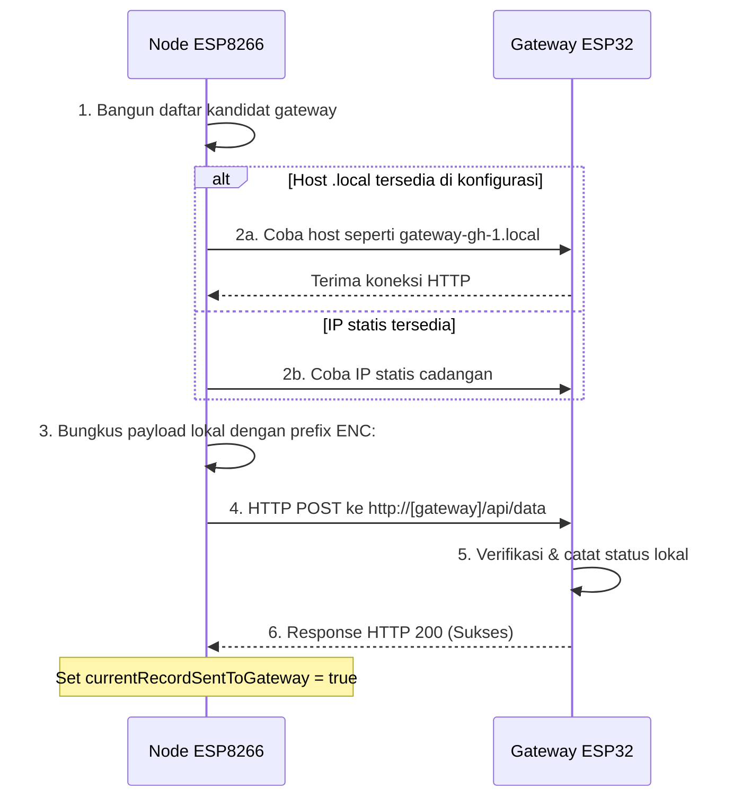

# Alur Data: Node Sensor Ke Gateway IoT (Lokal)

Jika koneksi internet ke Laravel Cloud terputus, atau jika sistem berjalan dalam **Mode Edge**, data sensor dari **Node ESP8266** akan diarahkan langsung ke **Gateway IoT (ESP32)** di dalam jaringan Wi-Fi lokal greenhouse.

Halaman ini mendetailkan bagaimana node sensor menemukan gateway secara dinamis dan mengirimkan data secara lokal tanpa bantuan jaringan internet luar.

---

## Alur Kerja Pencarian dan Pengiriman Data Lokal

Berikut adalah urutan bagaimana node mengirim data ke gateway terdekat:

---

## Tahapan Implementasi di Codebase

### 1. Resolusi Target Gateway Dinamis
Di dalam helper upload, node membangun daftar kandidat URL gateway:
* Sistem memanggil `GatewayTargeting::resolvePreferredPair()` untuk mencari pasangan ID gateway utama (primary) dan cadangan (secondary).
* Node memakai hostname gateway dari konfigurasi, misalnya default `gateway-gh-1.local` dan `gateway-gh-2.local`.
* Jika alamat IP gateway statis sudah disimpan di konfigurasi node, IP tersebut juga dimasukkan sebagai kandidat.

### 2. Eksekusi Pengiriman Lokal (`performLocalGatewayUpload`)
Setelah alamat IP gateway didapatkan, kelas `ApiClientUploadController` (file `ApiClient.UploadFlow.cpp`) mengambil alih:
* Fungsi `performLocalGatewayUpload` dipanggil.
* Node menginisialisasi client HTTP biasa untuk jaringan lokal.
* Node mengirim payload lokal terenkripsi melalui HTTP POST ke endpoint gateway `/api/data`, misalnya `http://gateway-gh-1.local/api/data` atau `http://192.168.4.1/api/data`.

### 3. Konfirmasi Penerimaan
* Gateway ESP32 memproses data tersebut, menyimpannya di memori/database lokalnya, dan membalas dengan status sukses (`HTTP 200 OK`).
* Node sensor menerima balasan tersebut dan menandai status pengiriman internal `currentRecordSentToGateway = true`. Record tetap masih dapat dikirim ke cloud saat jalur cloud pulih, sehingga gateway lokal menjadi penyangga operasional, bukan pengganti permanen database cloud.

Lanjutkan ke **[Alur Gateway ke Aktuator](./alur-gateway-ke-aktuator.md)** untuk melihat bagaimana gateway memproses data lokal ini guna mengendalikan relay fisik greenhouse!
