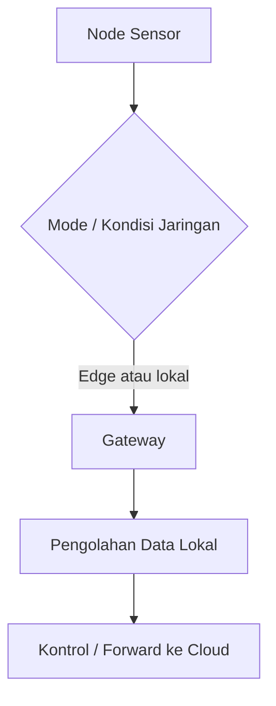

# Alur Node ke Gateway

Alur node ke gateway menjelaskan jalur lokal saat node sensor berkomunikasi dengan gateway.

## Alur Konsep

## Kenapa Jalur Ini Penting

Jalur lokal penting karena koneksi cloud tidak selalu stabil. Gateway dapat membantu sistem tetap memiliki pusat kendali di area greenhouse.

## Hal yang Harus Diverifikasi dari Kode

Dokumentasi file-by-file harus menjawab:

- format data dari node ke gateway,
- protokol yang dipakai,
- apakah memakai REST lokal, WebSocket, atau mekanisme lain,
- bagaimana autentikasi lokal dilakukan,
- bagaimana gateway membedakan node,
- apa yang terjadi jika gateway tidak tersedia.

## File yang Kemungkinan Terkait

- `node/lib/NodeCore/api/`,
- `node/lib/NodeCore/web/`,
- `gateway/src/SensorDataManager.cpp`,
- `gateway/src/MyNetworkManager.cpp`,
- `gateway/src/WebSocketManager.cpp`.

Daftar ini masih hipotesis awal dari nama dan inventory; detail harus diverifikasi saat membaca kode.

Lanjutkan ke [Alur Gateway ke Aktuator](./alur-gateway-ke-aktuator.md).
