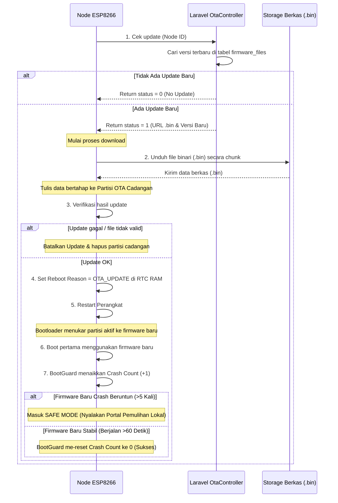

# Alur Kerja OTA (Over-The-Air) Update dan Recovery

Pembaruan firmware nirkabel (OTA Update) memungkinkan pengembang meningkatkan performa node atau memperbaiki bug secara remote. Namun, karena file diunduh melalui Wi-Fi, kita harus memastikan proses ini aman dan memiliki jalur pemulihan (*rollback/recovery*) jika terjadi kegagalan.

Halaman ini menjelaskan alur lengkap bagaimana perangkat mengecek, mengunduh, memverifikasi, dan melakukan pemulihan darurat jika firmware baru rusak.

---

## Diagram Sekuensial Proses OTA dan Recovery

---

## Penjelasan Detail Tahapan

### 1. Pengecekan Versi Firmware
Node sensor mengirim request berkala ke Laravel cloud melalui endpoint `/api/get-file/{nodeId}`:
* Laravel `OtaController.php` mencari data berkas terbaru di tabel `firmware_files` yang berstatus aktif untuk ID node tersebut.
* Server membalas `status`, `version`, `file_url`, dan `node_id`. Di sisi firmware, versi server dibandingkan dengan `FIRMWARE_VERSION`; update hanya berjalan jika versi server lebih baru.

### 2. Penulisan ke Partisi Cadangan (Dual-Partition Flash)
ESP8266 membagi memori flash programnya menjadi dua area virtual utama: **Partisi Aktif** dan **Partisi OTA (Cadangan)**.
* Saat pengunduhan berlangsung menggunakan kelas `ESP8266HTTPUpdate`, file program baru yang diunduh tidak langsung menimpa program yang sedang berjalan.
* Data biner ditulis secara bertahap ke dalam **Partisi OTA (Cadangan)**. Jika di tengah jalan koneksi putus atau mati lampu, program lama di Partisi Aktif masih utuh dan perangkat tetap bisa menyala normal.

### 3. Verifikasi Hasil Update
Firmware memakai `ESP8266HTTPUpdate` untuk mengunduh dan memasang file. Jika response update gagal, URL bukan HTTPS, heap tidak cukup, atau file tidak valid, proses dibatalkan. Kode juga dapat membaca field `md5` jika server menyediakannya; tetapi `OtaController.php` di repo ini saat ini hanya mengembalikan `version`, `file_url`, `status`, dan `node_id`.

### 4. Aktivasi dan Penukaran Partisi (Partition Swap)
Jika update valid:
* Node menulis alasan reboot `BootGuard::RebootReason::OTA_UPDATE` ke RTC RAM.
* Node memanggil perintah `ESP.restart()`.
* Saat booting, chip Bootloader internal ESP8266 mendeteksi bendera update yang valid pada Partisi OTA, lalu menukar peran partisi: Partisi Cadangan kini menjadi Partisi Aktif, dan sebaliknya.

### 5. Pengawasan Booting Baru oleh `BootGuard`
Ketika firmware baru mulai berjalan:
* `BootGuard` langsung menaikkan *Crash Count*.
* Jika program baru tersebut mengandung bug fatal (seperti pembagian nol atau kehabisan memori) yang membuatnya restart berulang kali sebelum sempat berjalan stabil selama 60 detik, *Crash Count* akan menumpuk.
* Begitu melewati batas 5 kali crash, `BootGuard` mendeteksi terjadinya **Bootloop** dan menahan sistem agar tidak booting normal, melainkan masuk ke **Safe Mode** sehingga pengembang dapat melakukan pemulihan lokal.

Lanjutkan ke **[Alur Keamanan](./alur-keamanan.md)** untuk melihat bagaimana integritas data dan proteksi jaringan dijalankan di seluruh sistem!
