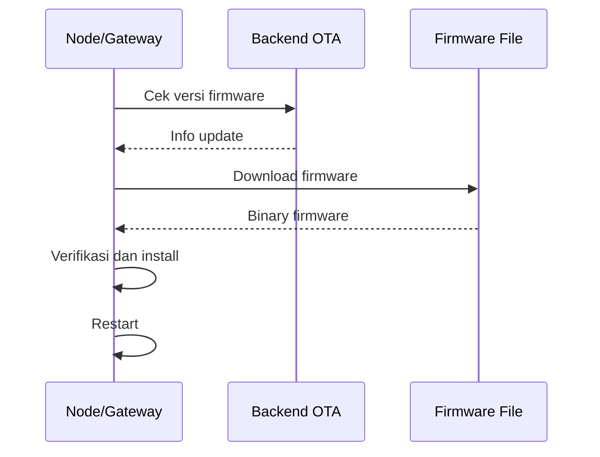

# Alur OTA

OTA update memungkinkan firmware diperbarui melalui jaringan.

## Alur Konsep

## Titik Risiko

- perangkat salah membaca versi,
- URL firmware salah,
- download terputus,
- file firmware rusak,
- storage tidak cukup,
- verifikasi keamanan lemah,
- perangkat gagal boot setelah update.

## File yang Kemungkinan Terkait

- `node/lib/NodeCore/ota/`,
- `node/lib/NodeCore/commands/CheckUpdateCommand.*`,
- `gateway/platformio.ini`,
- `web/OtaController.php`.

Detail endpoint dan mekanisme validasi dibaca dari kode.

Lanjutkan ke [Alur Caching](./alur-caching.md).
