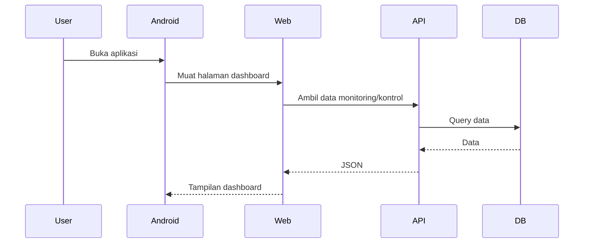

# Alur Web dan Android

Web dan Android adalah sisi yang dilihat pengguna. Web dashboard menampilkan data dan kontrol. Android WebView membuka web tersebut dalam aplikasi mobile.

## Alur Konsep

## Web Dashboard

Web dashboard kemungkinan bertugas:

- login,
- monitoring,
- grafik,
- heatmap,
- table,
- threshold control,
- scheduling control,
- OTA management.

Yang sudah terlihat di inventory awal adalah potongan Vue dan controller, bukan struktur web lengkap. Detail tiap halaman harus diverifikasi dari file `web/`.

## Android WebView

Android WebView tidak selalu membuat UI native lengkap. WebView membuka halaman web di dalam aplikasi Android.

Hal yang perlu didokumentasikan:

- URL yang dibuka,
- permission internet,
- handling loading,
- handling error,
- perilaku tombol back jika ada,
- keamanan WebView jika ada.

Lanjutkan ke [Alur OTA](./alur-ota.md).
