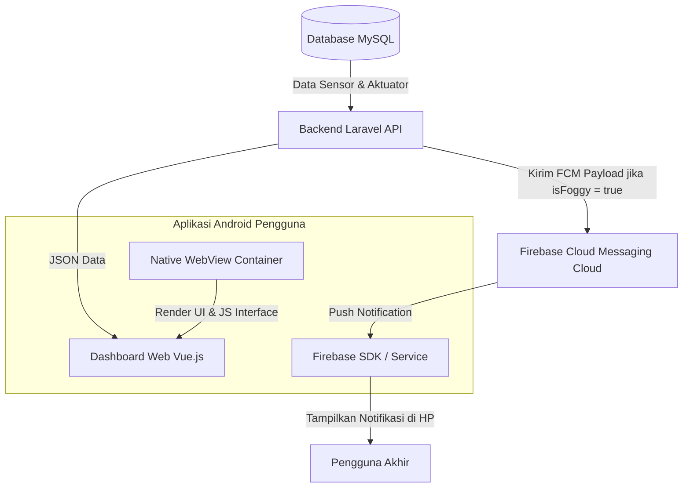

# Alur Kerja Integrasi Dashboard Web dan Aplikasi Android

Bagaimana pengguna akhir (pemilik greenhouse anggrek) memantau kondisi tanaman mereka? Sistem menyediakan antarmuka modern yang terdiri dari **Dashboard Web Vue.js**, **Container Aplikasi Android (WebView)**, serta **Firebase Cloud Messaging (FCM)** untuk notifikasi waktu nyata.

Halaman ini menjelaskan bagaimana ketiga teknologi ini bersinergi menyajikan data sensor dan mengirimkan peringatan darurat ke tangan pengguna.

---

## Arsitektur Interaksi Pengguna

Alur data dari database server hingga ke layar HP pengguna berjalan sebagai berikut:

---

## Detail Komponen Antarmuka

### 1. Dashboard Web (Vue.js Frontend)
Dashboard web dibangun secara terpisah atau terintegrasi dengan Laravel:
* **Pengambilan Data (Polling/Fetch):** Menggunakan library Axios untuk menembak endpoint API Laravel seperti `/api/sensor-snapshots` (untuk data terbaru) dan `/api/sensor-history` (untuk grafik tren).
* **Render UI Dinamis:** Menampilkan grafik garis historis suhu/kelembapan menggunakan library Chart.js, serta status sakelar relay ( blower, exhaust, dehumidifier) dengan tombol interaktif.
* **Fitur Override:** Ketika tombol sakelar diklik, Vue.js mengirim HTTP POST berisi perintah manual ke backend Laravel, yang kemudian akan diteruskan ke gateway lokal.

### 2. Aplikasi Android (WebView Container)
Alih-alih membangun aplikasi Android dari nol yang memakan waktu pemeliharaan ganda, kita menggunakan arsitektur **Hybrid WebView**:
* **Native Shell:** Aplikasi Android berupa aplikasi native ringan yang membungkus komponen `WebView` Android.
* **Optimalisasi Mobile:** WebView dikonfigurasi khusus dengan mengaktifkan JavaScript (`setJavaScriptEnabled(true)`), caching lokal (`DOMStorage`), dan menghilangkan margin/header web desktop agar dashboard pas di layar HP.
* **JavaScript Interface:** Menjembatani fungsi native Android (seperti getaran getar haptik atau akses kamera) agar bisa dipicu langsung dari kode JavaScript Vue.js.

### 3. Firebase Cloud Messaging (FCM) untuk Peringatan Kabut
Salah satu fitur penting Tugas Akhir ini adalah deteksi kabut otomatis menggunakan kamera ESP32-Cam di lapangan:
1.  Kamera mengunggah foto ke Laravel.
2.  Server memproses gambar dan mendeteksi adanya kabut (`isFoggy = true`).
3.  Jika terdeteksi kabut dengan tingkat keyakinan tinggi, backend Laravel memicu fungsi kirim notifikasi melalui **Firebase Cloud Messaging API**.
4.  Laravel mengirim payload ke topik global, misalnya `greenhouse-alerts`.
5.  Aplikasi Android yang berjalan di latar belakang HP pengguna (telah berlangganan ke topik tersebut lewat Firebase SDK) akan langsung menerima notifikasi push dan menampilkan popup peringatan: **"Peringatan: Greenhouse mendeteksi kabut tebal!"** secara instan meskipun aplikasi sedang ditutup.

Kembali ke **[Overview Arsitektur](./overview.md)** atau lanjutkan ke bagian detail implementasi fisik pada bagian **Hardware**!
