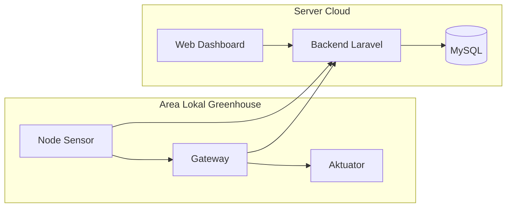

# Arsitektur Cloud-Edge

Arsitektur cloud-edge membagi pekerjaan antara server cloud dan perangkat lokal.

## Peran Cloud

Cloud berperan sebagai pusat data dan layanan jarak jauh:

- menerima data sensor,
- menyimpan data ke database,
- menyediakan API,
- melayani dashboard web,
- menyediakan data untuk Android,
- menyediakan firmware OTA jika fitur itu aktif.

## Peran Edge

Edge berada dekat dengan greenhouse, biasanya melalui gateway. Peran edge:

- membaca atau menerima data dari node lokal,
- melakukan keputusan lokal,
- mengendalikan aktuator,
- tetap memberi fungsi tertentu saat cloud tidak stabil,
- menyediakan terminal atau dashboard lokal jika tersedia.

## Diagram

## Mode Operasi

Mode cloud, edge, dan auto menentukan jalur kerja perangkat:

- cloud mengutamakan server untuk penyimpanan dan dashboard,
- edge mengutamakan gateway lokal saat keputusan perlu dekat dengan greenhouse,
- auto memilih jalur yang paling sesuai dengan kondisi koneksi.

Detail penyimpanan mode, pengubah mode, dan fallback dibahas pada file firmware yang mengatur pengiriman data dan gateway.

Lanjutkan ke [Alur Node ke Cloud](./alur-node-ke-cloud.md).
