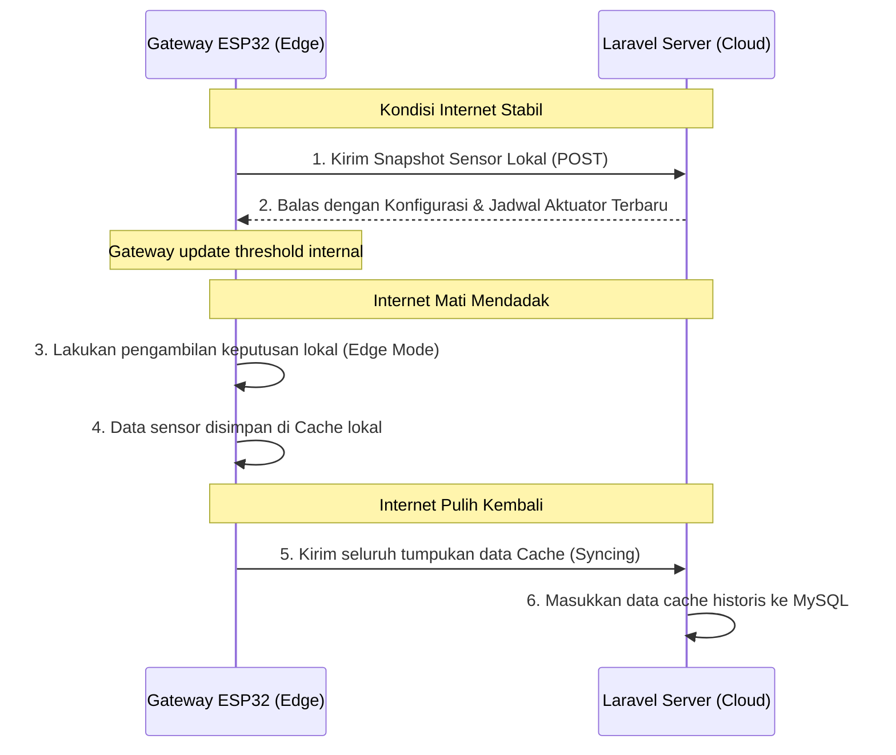

# Arsitektur Komputasi Cloud-Edge

Dalam sistem IoT modern, memindahkan semua beban komputasi dan keputusan ke server internet (Cloud) adalah langkah yang kurang bijak. Koneksi internet bisa putus sewaktu-waktu. Jika kontrol tanaman bergantung 100% pada internet, tanaman anggrek bisa layu atau mati jika internet mati berhari-hari.

Tugas Akhir ini mengadopsi **Arsitektur Hybrid Cloud-Edge**, membagi beban kerja secara cerdas antara server cloud jarak jauh dan gateway/node lokal di lapangan.

---

## Pembagian Beban Kerja (Cloud vs Edge)

Berikut adalah matriks pembagian tanggung jawab sistem:

| Fitur / Tugas | Komputasi Cloud (Server Laravel) | Komputasi Edge (Gateway ESP32 & Node) |
| :--- | :--- | :--- |
| **Penyimpanan Data** | Historis permanen (MySQL), cadangan bertahun-tahun. | Antrean lokal jangka pendek di RTC RAM dan LittleFS. |
| **Pengambilan Keputusan** | Statistik jangka panjang, prediksi AI kabut, penjadwalan mingguan. | Respon darurat cepat (nyalakan kipas/pompa instan jika melewati threshold). |
| **Keamanan** | Otentikasi user/JWT pada aplikasi web dan HTTPS di server. | BearSSL untuk HTTPS, AES-256-CBC pada jalur lokal tertentu, CRC32 untuk data internal, dan validasi OTA dengan checksum jika server menyediakannya. |
| **Sumber & Konsumsi Daya** | Tidak terbatas (Listrik server konstan). | Listrik AC melalui Adaptor/PSU 5V 3A (Node dioptimalkan untuk meminimalkan panas). |
| **Ketergantungan Internet** | Mutlak (Tanpa internet, web & API tidak bisa diakses). | Mandiri (Tetap bisa mengontrol aktuator secara lokal tanpa internet). |

---

## Bagaimana Keduanya Sinkron?

Ketika sistem berada dalam **Mode Auto** (Mode Otomatis), sinkronisasi data cloud dan edge berjalan dengan protokol berkala:

1.  **Pembaruan Threshold Kontrol:**
    Pengguna mengubah batas suhu aman di website (Cloud). Perubahan ini disimpan di database server. Pada siklus kirim data berikutnya, Gateway (Edge) meminta konfigurasi terbaru, lalu menyimpan threshold baru tersebut ke dalam flash internalnya.
2.  **Transmisi Historis Tertunda:**
    Saat internet terputus, data sensor diantrekan di memori lokal. Begitu internet terhubung kembali, Gateway secara otomatis mengunggah seluruh antrean data secara bertahap tanpa membebani server, memastikan grafik sejarah di cloud tetap utuh tanpa ada lubang waktu kosong (*data gap*).

Lanjutkan ke **[Alur Node ke Cloud](./alur-node-ke-cloud.md)** untuk melihat bagaimana data sensor menembus internet menuju server Laravel!
