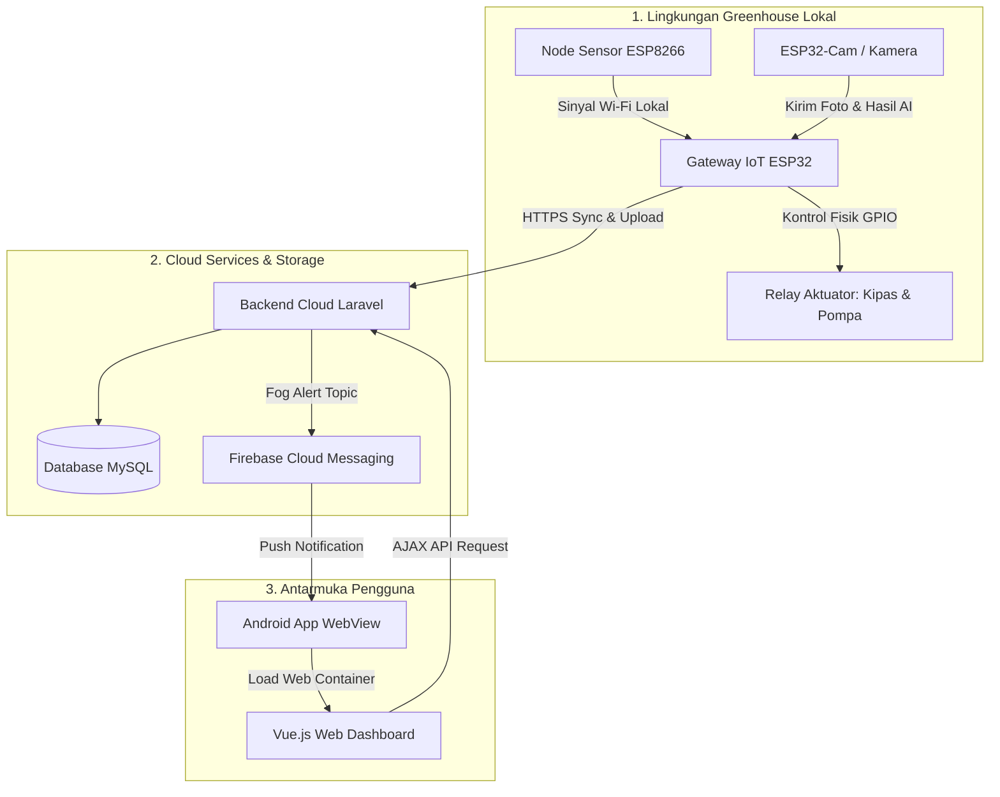

# Overview Arsitektur Sistem

Selamat datang di bagian **Arsitektur Sistem**! Jika di bagian fondasi kita sudah membahas cara kerja dasar per komponen seperti enkripsi, database, dan sensor, sekarang saatnya melihat bagaimana semua potongan puzzle tersebut dirangkai menjadi satu kesatuan sistem yang utuh.

Arsitektur sistem ini dirancang khusus untuk memantau dan mengontrol kondisi iklim mikro greenhouse anggrek secara mandiri, aman, dan tahan terhadap gangguan koneksi internet.

---

## Peta Blok Komponen Sistem

Sistem Tugas Akhir ini terdiri dari 5 pilar utama yang saling terhubung:

---

## Pembagian Peran dan Tanggung Jawab

Berikut adalah ringkasan tanggung jawab dari setiap komponen dalam arsitektur kita:

*   **Node Sensor (ESP8266):** Pengumpul data paling depan. Membaca sensor suhu/kelembapan, melakukan enkripsi payload, dan mengantrekan data ke memori lokal jika jaringan sedang bermasalah.
*   **Gateway IoT (ESP32):** Bertindak sebagai koordinator lokal (*Local Hub*). Memancarkan Wi-Fi lokal untuk node, menerima data sensor, menjalankan logika kontrol aktuator secara offline (Edge), dan mengunggah data gabungan ke cloud.
*   **Backend Laravel:** Pintu gerbang data di internet. Menyediakan API untuk perangkat keras, mengelola otentikasi pengguna, memvalidasi payload, memproses file update OTA, dan memicu notifikasi push ke Firebase.
*   **Database MySQL:** Penyimpan data permanen di cloud, memisahkan data historis detail untuk grafik dari data status snapshot terkini agar pemuatan data berjalan super cepat.
*   **Dashboard Web & Android:** Menyediakan visualisasi grafik pertumbuhan bagi pengguna serta kendali manual aktuator dari jarak jauh.

---

## Alur Pembacaan Halaman Arsitektur

Agar kamu mendapatkan pemahaman yang runtut, disarankan membaca halaman-halaman arsitektur ini secara berurutan sesuai alur jalannya data:

1.  **[Arsitektur Cloud-Edge](./arsitektur-cloud-edge.md):** Pembagian beban kerja komputasi antara server internet dan perangkat lokal greenhouse.
2.  **[Alur Node ke Cloud](./alur-node-ke-cloud.md):** Bagaimana data dari node sensor langsung melompat ke server Laravel melalui internet.
3.  **[Alur Node ke Gateway](./alur-node-ke-gateway.md):** Bagaimana data dari node sensor mengalir ke gateway lokal menggunakan protokol mDNS/IP.
4.  **[Alur Gateway ke Aktuator](./alur-gateway-ke-aktuator.md):** Bagaimana gateway memutuskan untuk menyalakan/mematikan kipas atau pompa berdasarkan threshold.
5.  **[Alur Caching](./alur-caching.md):** Penyelamatan data sensor ke memori lokal saat koneksi internet terputus.
6.  **[Alur OTA](./alur-ota.md):** Mekanisme pembaruan firmware nirkabel yang aman dari resiko mati total (*brick*).
7.  **[Alur Keamanan](./alur-keamanan.md):** Lapisan keamanan sistem, termasuk TLS/HTTPS, token upload, AES pada jalur lokal tertentu, dan timestamp replay protection di firmware.
8.  **[Alur Web dan Android](./alur-web-dan-android.md):** Bagaimana dashboard web disajikan dan notifikasi Firebase dikirimkan ke HP Android pengguna.

Mari kita mulai dengan mendalami **[Arsitektur Cloud-Edge](./arsitektur-cloud-edge.md)**!
