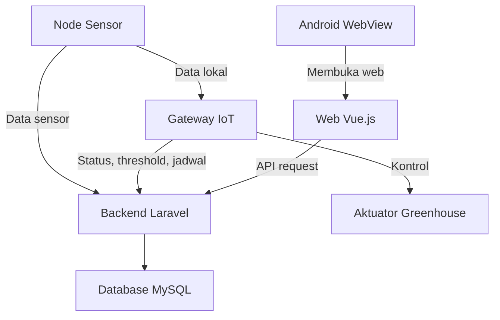

# Overview Arsitektur Sistem

Arsitektur sistem menjelaskan hubungan antar komponen. Tujuannya agar pembaca memahami alur besar sebelum membaca file-by-file.

## Komponen Besar

Sistem TA IoT Greenhouse terdiri dari:

- node sensor,
- gateway IoT,
- backend Laravel,
- database MySQL,
- frontend web Vue.js,
- Android WebView,
- jaringan dan keamanan,
- OTA update,
- caching.

## Alur Besar

## Cara Membaca Arsitektur

Baca arsitektur dari alur data, bukan dari nama teknologi.

1. Data dibuat oleh node sensor.
2. Data dikirim atau disimpan sementara.
3. Backend menerima dan menyimpan data.
4. Web dan Android membaca data.
5. Gateway memakai data, threshold, dan jadwal untuk kontrol.
6. OTA dan keamanan menjaga sistem tetap bisa dirawat dan lebih aman.

## Catatan Pembacaan

Halaman ini adalah gambaran besar. Detail fungsi tiap file dibahas di dokumentasi file-by-file agar pembaca bisa melihat hubungan antara arsitektur dan implementasi.

Lanjutkan ke [Arsitektur Cloud-Edge](./arsitektur-cloud-edge.md).
