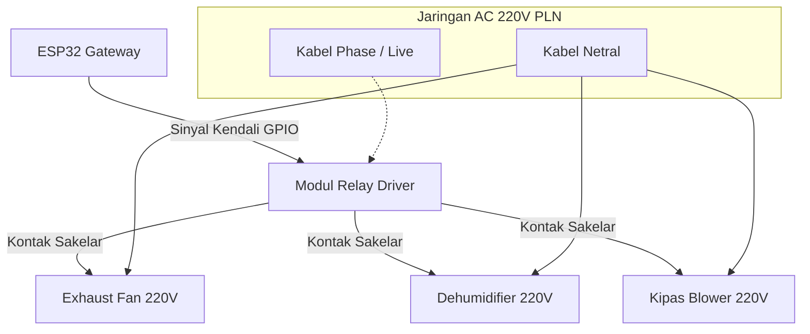

# Peralatan Aktuator (Climate Control)

Untuk mengubah kondisi iklim mikro di dalam greenhouse anggrek secara aktif, **Gateway IoT** terhubung ke tiga peralatan aktuator utama bertegangan tinggi (**220V AC**). Peralatan ini bekerja secara otomatis berdasarkan evaluasi threshold sensor suhu dan kelembapan.

Berikut adalah spesifikasi dan fungsi dari masing-masing aktuator yang dikendalikan oleh sistem:

---

## Tiga Aktuator Utama

### 1. Exhaust Fan (Kipas Pembuang Udara)
*   **Fungsi:** Mengeluarkan akumulasi udara panas dan pengap dari bagian atas greenhouse ke luar ruangan. Aktifnya Exhaust Fan menciptakan tekanan negatif ringan yang menarik udara luar yang lebih segar masuk melalui celah dinding/paranet.
*   **Kondisi Pemicu:** Menyala otomatis ketika suhu udara di dalam greenhouse melebihi batas atas threshold (misal suhu $> 30^\circ\text{C}$).
*   **Spesifikasi Umum:** Motor AC 220V, dipasang pada dinding bagian atas greenhouse (tempat udara panas berkumpul secara alami).

### 2. Dehumidifier (Penyerap Kelembapan)
*   **Fungsi:** Menyerap kandungan uap air berlebih di dalam udara. Anggrek rentan terhadap kelembapan malam hari yang jenuh ($> 90\%$ RH) tanpa sirkulasi, karena dapat memicu spora jamur berkembang biak.
*   **Kondisi Pemicu:** Menyala otomatis ketika kelembapan relatif terdeteksi terlalu tinggi (misal kelembapan $> 85\%$ RH).
*   **Spesifikasi Umum:** Kompresor refrigerasi mini AC 220V yang memadatkan uap air menjadi tetesan air untuk dialirkan keluar.

### 3. Kipas Blower (Sirkulasi Udara Internal)
*   **Fungsi:** Menciptakan hembusan angin internal secara merata di area sekitar daun dan akar anggrek. Angin buatan ini menirukan habitat alami anggrek di hutan, mencegah udara mengendap basah yang memicu kebusukan akar (*root rot*).
*   **Kondisi Pemicu:** Beroperasi secara berkala (timer schedule) atau diaktifkan saat kelembapan udara mendekati batas atas untuk mempercepat penguapan air sisa penyiraman pada sela-sela daun.
*   **Spesifikasi Umum:** Kipas sirkulasi AC 220V berdaya dorong udara menengah.

---

## Skema Pengendalian Aktuator

---

## Keselamatan Kerja Listrik AC 220V

Karena perangkat aktuator menggunakan tegangan tinggi (220V AC) di lingkungan greenhouse yang basah dan lembap:
*   **Gunakan Panel Box Waterproof:** Seluruh modul relay, kabel AC, terminal listrik, dan mikrokontroler wajib dimasukkan ke dalam panel box berbahan plastik ABS yang tertutup rapat (minimal sertifikasi IP65) untuk melindunginya dari cipratan air penyiraman.
*   **Pasang Sekring Pengaman:** Jalur input utama AC 220V sebelum masuk ke relay wajib dilengkapi dengan MCB (Miniature Circuit Breaker) atau sekring pengaman 2A/5A untuk mencegah bahaya kebakaran akibat korsleting beban aktuator.

Lanjutkan ke [Relay & SSR](./relay-ssr.md) untuk mempelajari bagaimana sinyal GPIO tegangan rendah mengendalikan sakelar tegangan tinggi secara aman!
