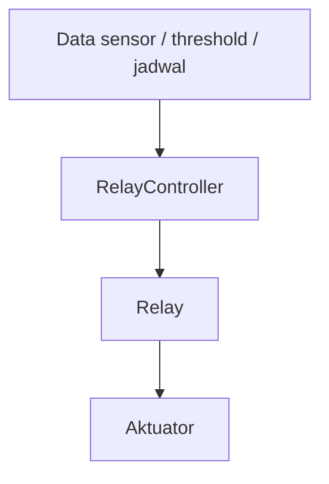

# Aktuator

Aktuator adalah perangkat yang melakukan aksi fisik. Dalam konteks gateway, aktuator dikendalikan melalui relay atau SSR.

## Aktuator yang Terlihat dari Kode

Berdasarkan `gateway/include/config.h` dan `gateway/include/RelayController.h`, aktuator yang diberi nama adalah:

- exhaust,
- dehumidifier,
- blower,
- channel unused.

`RelayController` juga memakai keputusan dari manual override, schedule, threshold, dan hold.

## Alur Konsep

## Yang Harus Hati-hati

- Jangan menganggap semua aktuator sama.
- Setiap channel relay bisa punya fungsi berbeda per greenhouse.
- Waktu nyala/mati perlu memperhatikan perangkat fisik.
- Manual override harus punya batas waktu agar tidak lupa aktif.
- Failsafe penting saat data atau koneksi hilang.

Lanjutkan ke [LCD](./lcd.md).
