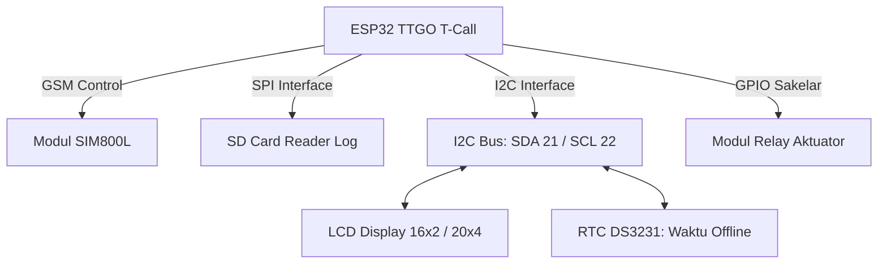

# Gateway IoT (ESP32 TTGO T-Call)

**Gateway IoT** bertindak sebagai otak lokal (koordinator) di dalam greenhouse. Gateway menerima data dari node-node sensor, mengambil keputusan lokal untuk mengendalikan kipas/pompa (Edge), dan mengunggah data tersebut ke Laravel Cloud.

Perangkat utama yang digunakan adalah **ESP32 LilyGO TTGO T-Call V1.3 / V1.4** yang terintegrasi dengan modul GSM/GPRS SIM800L.

---

## Spesifikasi Perangkat Keras Gateway

*   **Chipset Utama:** ESP32-WROVER-B (Dual-core Tensilica Xtensa 32-bit LX6, kecepatan clock 240 MHz).
*   **Memori:** 4 MB Flash Memory, 8 MB PSRAM (RAM eksternal tambahan untuk menangani pemrosesan data besar dan enkripsi).
*   **Konektivitas Nirkabel:**
    *   Wi-Fi 802.11 b/g/n (untuk membuat Local Access Point atau terhubung ke router).
    *   Bluetooth v4.2 BR/EDR & BLE.
    *   **GSM/GPRS (SIM800L):** Koneksi seluler 2G sebagai jalur internet cadangan (*failover*) jika Wi-Fi mati.

---

## Peta Pinout Gateway (Berdasarkan `config.h`)

Untuk menghubungkan seluruh periferal diagnostic dan penyimpanan, Gateway memanfaatkan pinout ESP32 berikut:

### 1. Pin Kendali GSM Modem (SIM800L)
*   **GSM TX / RX (Serial):** Pin 26 / Pin 27 (Komunikasi AT Command).
*   **GSM PWR (Power Key):** Pin 4 (Menyalakan/mematikan modem via software).
*   **GSM RST (Reset):** Pin 5 (Reset fisik modem).
*   **MODEM_POWER_ON:** Pin 23 (Suplai daya ke sirkuit SIM800L).

### 2. Pin Penyimpanan Lokal (SD Card - SPI)
*   **SD CS (Chip Select):** GPIO 2.
*   **SD SCK (Clock):** GPIO 18.
*   **SD MISO (Master In Slave Out):** GPIO 19.
*   **SD MOSI (Master Out Slave In):** GPIO 13.

### 3. Pin Antarmuka I2C (LCD & RTC)
*   **SDA_PIN (Data):** GPIO 21.
*   **SCL_PIN (Clock):** GPIO 22.
*   *Semua modul I2C terhubung paralel pada sepasang pin ini dengan alamat unik (misal LCD pada `0x27`).*

### 4. Pin Penggerak Relay Aktuator
Tergantung pada Greenhouse ID yang diatur di *compiler flags* (`GH_ID_CONFIG` 1 atau 2), pinout relay diatur dinamis untuk mencocokkan konfigurasi kabel fisik di lapangan (selengkapnya dibahas di bab Wiring).

Lanjutkan ke [Wiring](./wiring.md) untuk melihat panduan diagram koneksi kabel lengkap antar modul!
