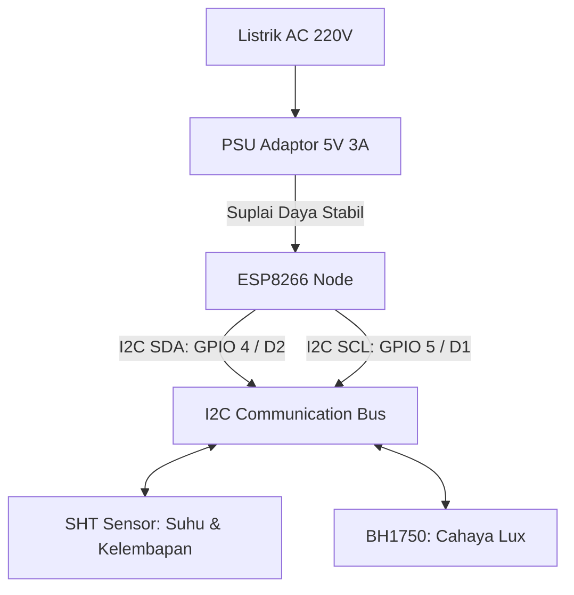

# Node Sensor (ESP8266)

**Node Sensor** adalah unit pengumpul data lingkungan terdepan yang ditempatkan langsung di area pertumbuhan tanaman anggrek. Node ini dirancang berbasis chip mikrokontroler **ESP8266** (seperti Wemos D1 Mini atau NodeMCU) yang ringkas, memiliki konektivitas Wi-Fi terintegrasi, dan hemat biaya.

---

## Spesifikasi Perangkat Keras Node

*   **Chipset Utama:** ESP8266EX (CPU 32-bit Tensilica L106, kecepatan clock 80 MHz / 160 MHz).
*   **Memori:** 4 MB Flash Memory (ROM untuk program dan filesystem LittleFS), 80 KB SRAM.
*   **Konektivitas:** Wi-Fi 802.11 b/g/n (2.4 GHz).
*   **Jalur Sensor:** Antarmuka **I2C Bus** menggunakan pin:
    *   **SDA (Serial Data):** GPIO 4 (Pin D2 pada Wemos D1 Mini).
    *   **SCL (Serial Clock):** GPIO 5 (Pin D1 pada Wemos D1 Mini).

---

## Sistem Catu Daya (Power Supply 5V 3A)

Berbeda dengan sistem sensor luar ruangan yang sering menggunakan baterai atau panel surya kecil, node sensor pada Tugas Akhir ini **dihubungkan langsung ke listrik AC jala-jala melalui Catu Daya / PSU (Power Supply Unit) DC 5V dengan arus minimal 3 Ampere (5V 3A)**.

### Mengapa Menggunakan 5V 3A?
1.  **Stabilitas Transmisi Wi-Fi:** Chip ESP8266 membutuhkan lonjakan arus sesaat hingga **300-400 mA** ketika memancarkan sinyal Wi-Fi untuk mengirimkan request HTTPS ke server. Jika catu daya terlalu lemah (misal charger HP 1A murahan), tegangan akan drop dan memicu reset perangkat secara acak (*brownout*).
2.  **Akurasi Sensor:** Sensor SHT31 dan BH1750 membutuhkan tegangan suplai yang sangat stabil agar hasil pembacaan analog dan digitalnya presisi. PSU 5V 3A berkualitas menjamin tegangan tidak berfluktuasi saat kipas/aktuator lain di dekatnya aktif.
3.  **Ketiadaan Degradasi Baterai:** Dengan listrik AC konstan, sistem dapat mengambil sampel data secara kontinyu tanpa perlu khawatir perangkat mati di tengah malam karena kehabisan baterai.

---

## Antarmuka Sensor Lokal

Node sensor mengelola dua modul sensor utama secara paralel pada bus I2C yang sama:

*   **SHT Sensor:** Digunakan untuk membaca parameter termal dan uap air melalui I2C. Kode node memakai library `SHTSensor`, jadi jalur DHT22 single-wire tidak aktif di firmware saat ini.
*   **BH1750:** Sensor lux digital yang mengukur intensitas cahaya matahari yang menembus paranet greenhouse untuk mengevaluasi kecukupan cahaya anggrek.

Lanjutkan ke [Sensor Suhu dan Kelembapan](./sensor-suhu-kelembapan.md) untuk mendalami karakteristik pembacaan parameter termal greenhouse!
