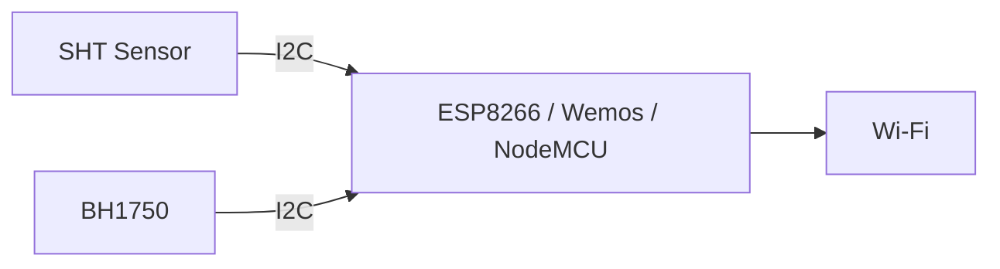

# Node Sensor

Node sensor adalah perangkat yang membaca kondisi lingkungan greenhouse. Berdasarkan file yang sudah dibaca, node memakai jalur I2C untuk sensor.

## Bukti dari Kode

File `node/include/config/hardware_pins.h` mendefinisikan:

| Fungsi | GPIO | Label NodeMCU/Wemos |
|---|---:|---|
| I2C SDA | 4 | D2 |
| I2C SCL | 5 | D1 |

File `node/lib/NodeCore/sensor/SensorManager.h` menunjukkan penggunaan library:

- `BH1750` untuk sensor cahaya,
- `SHTSensor` untuk suhu dan kelembapan.

## Peran Node

Node bertugas:

1. membaca sensor,
2. memvalidasi pembacaan,
3. menyimpan status sensor,
4. mengirim data ke cloud atau gateway,
5. melakukan recovery jika sensor/I2C bermasalah.

## Alur Hardware Sederhana

## Catatan Pemula

I2C adalah jalur komunikasi dua kabel. SDA membawa data, SCL membawa clock. Jika kabel SDA/SCL tertukar, sensor bisa tidak terbaca.

Lanjutkan ke [Sensor Suhu dan Kelembapan](./sensor-suhu-kelembapan.md).
