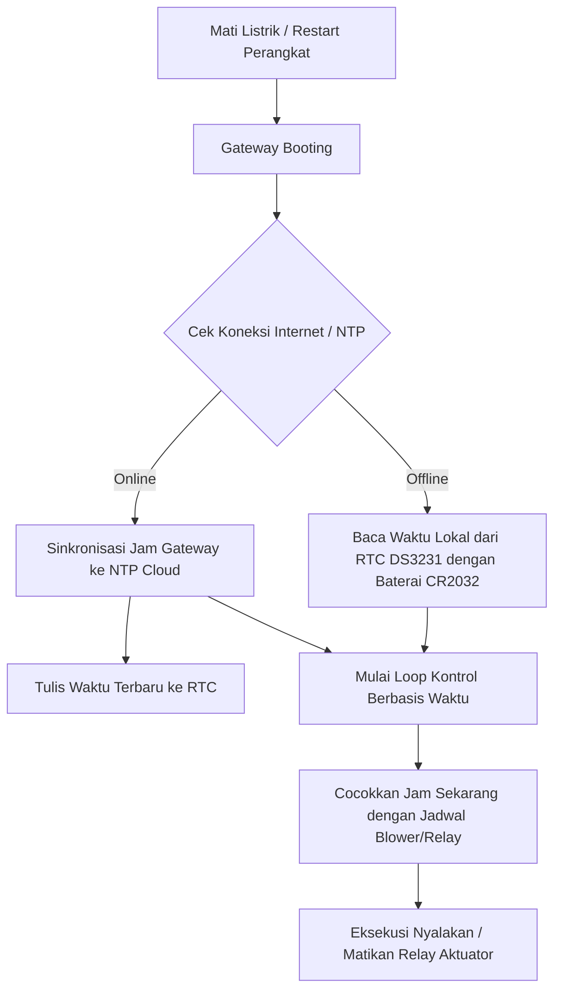

# Modul RTC DS3231 (Jam Waktu Presisi)

Jadwal penyiraman dan sirkulasi angin (seperti menyalakan kipas blower secara rutin) harus berjalan tepat waktu setiap harinya. Jika sistem mengandalkan jam internet (NTP) saja, maka ketika jaringan Wi-Fi/GSM terputus, Gateway IoT akan kehilangan acuan waktu dan gagal mengeksekusi jadwal penting tersebut.

Untuk mengatasinya, Gateway IoT dilengkapi modul **RTC (Real-Time Clock) DS3231**.

---

## Mengapa Memilih DS3231?

Modul RTC DS3231 adalah modul jam eksternal yang terhubung melalui bus I2C. Modul ini jauh lebih unggul dibanding modul RTC murah seperti DS1307 karena alasan berikut:

1.  **Akurasi Ekstrim dengan TCXO:** DS3231 memiliki kristal osilator terintegrasi dengan kompensasi suhu (**TCXO - Temperature Compensated Crystal Oscillator**). Kristal pada jam biasa cenderung berubah kecepatannya seiring perubahan suhu lingkungan (misal saat greenhouse memanas di siang hari). DS3231 memiliki sensor suhu internal yang mendeteksi perubahan suhu ini dan secara dinamis menyesuaikan frekuensi osilator. Akurasinya terjaga pada kisaran $\pm$2 menit per tahun!
2.  **Sistem Baterai Cadangan (CR2032 Coin Cell):** Modul ini dilengkapi slot baterai koin lithium CR2032 kecil.
    *   Ketika listrik AC jala-jala padam (menyebabkan catu daya utama Gateway mati), chip DS3231 secara otomatis beralih menggunakan daya baterai CR2032 ini untuk menjaga sirkuit jam internal tetap berdetak.
    *   Konsumsi arus dalam mode standby baterai ini sangat kecil ($< 1\,\mu\text{A}$), membuat baterai koin ini mampu bertahan hingga **5 s.d. 8 tahun** tanpa perlu diganti.
    *   Saat listrik utama kembali menyala, Gateway langsung membaca waktu terbaru dari DS3231 tanpa perlu tersambung internet untuk kalibrasi ulang.
3.  **Alamat I2C:** Secara bawaan menggunakan alamat I2C tetap `0x68`.

---

## Peran RTC dalam Offline Scheduling (Failsafe)

Saat Gateway berada dalam kondisi offline (tanpa koneksi internet):

*   **Penyelarasan Waktu Otomatis:** Saat pertama kali terhubung internet (NTP berhasil disinkronisasi), firmware Gateway (`RTCManager.cpp`) akan mengkalibrasi jam internal DS3231 agar sama presisi dengan waktu server dunia.
*   **Keamanan Eksekusi Jadwal:** Karena jam lokal selalu terjaga, jadwal harian (misalnya: *nyalakan Blower jam 08:00, matikan jam 16:00*) tetap dieksekusi dengan presisi detik yang sama, terlepas dari ada atau tidaknya koneksi internet di greenhouse.

Lanjutkan ke [SD Card](./sd-card.md) untuk melihat bagaimana data sensor disimpan secara lokal saat jaringan terputus!
