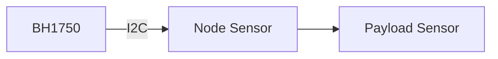

# Sensor Cahaya

Sensor cahaya membaca intensitas cahaya di greenhouse.

## Bukti dari Kode

`node/lib/NodeCore/sensor/SensorManager.h` memakai library `BH1750`. File tersebut juga menyimpan nilai `m_lightLevel` dan status `m_bh1750State`.

Nilai tidak valid untuk cahaya didefinisikan sebagai:

| Konstanta | Nilai |
|---|---:|
| `INVALID_LUX` | `-1.0` |

## Kenapa Cahaya Penting

Tanaman anggrek membutuhkan kondisi cahaya tertentu. Data cahaya membantu melihat apakah area greenhouse terlalu gelap atau terlalu terang.

## Alur Konsep

## Risiko Hardware

- sensor tertutup debu atau bayangan,
- posisi sensor tidak mewakili area tanaman,
- I2C gagal,
- pembacaan tidak dikalibrasi dengan kondisi nyata.

Lanjutkan ke [Relay dan SSR](./relay-ssr.md).
