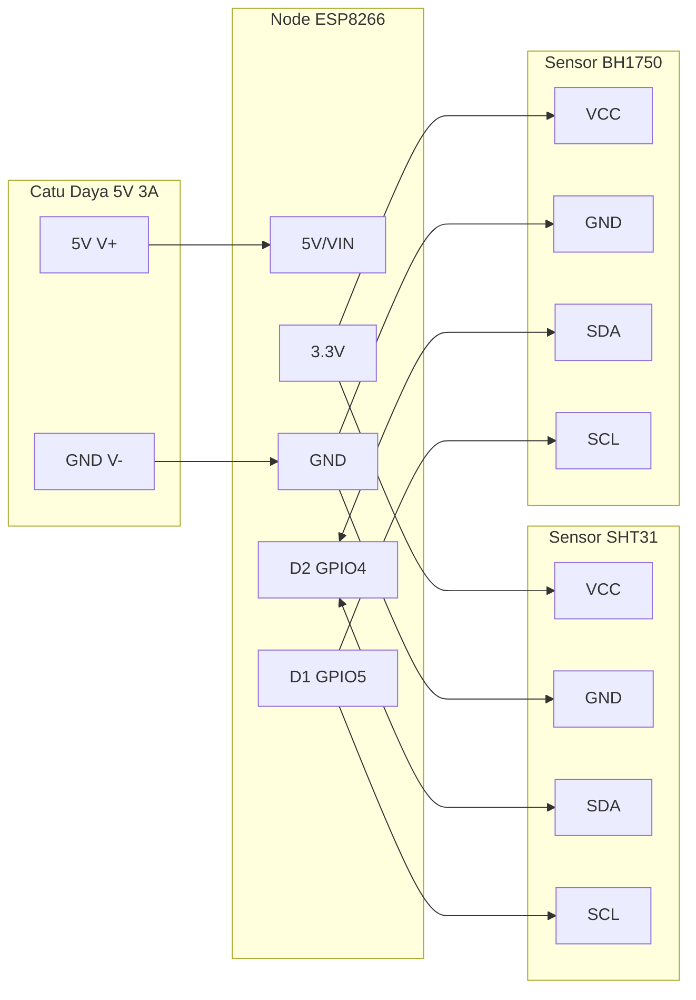

# Wiring Perangkat (Diagram Hubungan Kabel)

Kesalahan dalam menyambungkan kabel dapat mengakibatkan komponen gagal dideteksi, data tidak terbaca, atau bahkan memicu korsleting yang merusak mikrokontroler.

Halaman ini menyediakan tabel referensi pin fisik dan diagram wiring lengkap untuk **Node Sensor** dan **Gateway IoT**.

---

## 1. Wiring Node Sensor (ESP8266)

Node sensor ditenagai oleh **Adaptor/PSU 5V 3A** melalui terminal daya utama, sedangkan sensor-sensor dihubungkan ke bus I2C (3.3V):

| Nama Perangkat / Modul | Pin Modul | Pin Node ESP8266 | Keterangan |
| :--- | :--- | :--- | :--- |
| **Catu Daya / PSU 5V 3A** | V+ (5V Out) | `5V` atau `VIN` | Jalur daya utama perangkat |
| | V- (GND Out) | `GND` | Ground bersama |
| **Sensor SHT31** | VCC | `3V3` | Suplai daya sensor (3.3V) |
| | GND | `GND` | Ground |
| | SDA | `D2` (GPIO 4) | Jalur data I2C |
| | SCL | `D1` (GPIO 5) | Jalur clock I2C |
| **Sensor BH1750** | VCC | `3V3` | Suplai daya sensor (3.3V) |
| | GND | `GND` | Ground |
| | SDA | `D2` (GPIO 4) | Jalur data I2C (Paralel) |
| | SCL | `D1` (GPIO 5) | Jalur clock I2C (Paralel) |

---

## 2. Wiring Gateway IoT (ESP32 TTGO T-Call)

Gateway menghubungkan banyak modul eksternal, termasuk kartu SD (SPI), jam RTC, layar diagnostic LCD, dan modul Relay:

### Tabel Koneksi Periferal (SPI & I2C)

| Nama Perilferal | Pin Modul | Pin Gateway ESP32 | Keterangan |
| :--- | :--- | :--- | :--- |
| **SD Card Reader** | VCC | `5V` atau `3V3` | Suplai daya modul |
| | GND | `GND` | Ground |
| | CS | `GPIO 2` | Chip Select SPI |
| | SCK | `GPIO 18` | Serial Clock SPI |
| | MISO | `GPIO 19` | Master In Slave Out SPI |
| | MOSI | `GPIO 13` | Master Out Slave In SPI |
| **RTC DS3231** | VCC | `3V3` | Suplai daya modul |
| | GND | `GND` | Ground |
| | SDA | `GPIO 21` | Jalur data I2C |
| | SCL | `GPIO 22` | Jalur clock I2C |
| **LCD I2C (16x2 / 20x4)** | VCC | `5V` | Suplai daya LCD backlight |
| | GND | `GND` | Ground |
| | SDA | `GPIO 21` | Jalur data I2C (Paralel) |
| | SCL | `GPIO 22` | Jalur clock I2C (Paralel) |

---

### Tabel Koneksi Relay Aktuator (Perbedaan GH1 vs GH2)

Untuk mendrive sakelar relay AC 220V aktuator (Exhaust, Dehumidifier, Blower), kita menggunakan pinout dinamis tergantung pada build flag **`GH_ID_CONFIG`**:

| Saluran Relay | Nama Aktuator | Pin ESP32 (Greenhouse 1) | Pin ESP32 (Greenhouse 2) |
| :--- | :--- | :---: | :---: |
| **CH 1** | Exhaust Fan | **GPIO 32** | **GPIO 32** |
| **CH 2** | Dehumidifier | **GPIO 33** | **GPIO 33** |
| **CH 3** | Kipas Blower | **GPIO 14** | **GPIO 12** |
| **CH 4** | Cadangan (Unused) | **GPIO 12** | **GPIO 14** |

---

## Panduan Penting untuk Perakitan Hardware

1.  **Satukan Ground (Common Ground):** Pastikan semua pin `GND` dari setiap modul eksternal (SD Card, RTC, Relay, LCD) terhubung kembali ke pin `GND` utama pada ESP32/ESP8266 agar level tegangan referensinya sama.
2.  **Pull-up Resistor untuk I2C:** Sensor SHT31 dan BH1750 biasanya sudah memiliki resistor pull-up internal pada modul *breakout board*-nya. Jika Anda menyambungkan kabel I2C yang terlalu panjang (> 1 meter), Anda perlu menambahkan resistor pull-up eksternal sebesar `4.7 kOhm` antara jalur SDA/SCL ke VCC 3.3V untuk mencegah hilangnya sinyal clock.
3.  **Gunakan PSU 5V Terpisah untuk Relay:** Modul relay elektromekanik mengonsumsi arus yang cukup besar saat kumparan magnetnya aktif (sekitar 70-100 mA per relay). Sangat direkomendasikan memberi daya modul relay dari suplai 5V terpisah agar tidak mengganggu tegangan suplai mikrokontroler utama.

Lanjutkan ke [Sensor Suhu dan Kelembapan](./sensor-suhu-kelembapan.md) untuk memahami pemasangan fisik dan pembacaan datanya!
