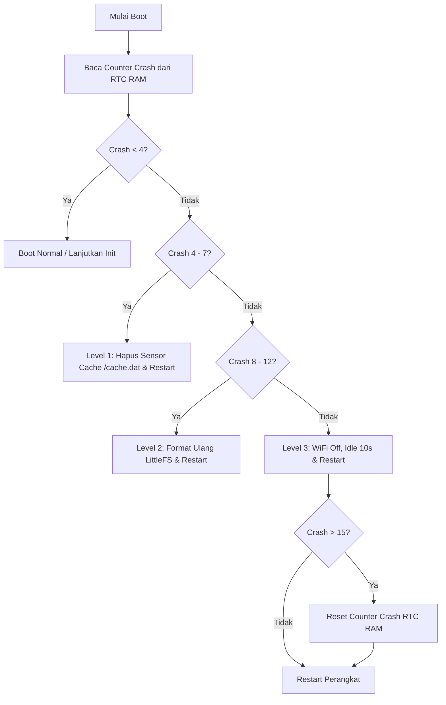

# Boot Sequence & Self-Healing

Boot sequence adalah urutan kritis dari awal mikrokontroler ESP8266 menerima daya listrik hingga sistem masuk ke dalam loop aplikasi utama. Urutan ini dirancang secara defensif untuk mencegah kondisi kerusakan permanen (*bricking*) akibat *boot loop* berulang.

---

## Alur Setup Utama (`setup()` di `main.cpp`)

Ketika perangkat dinyalakan atau setelah terjadi restart, fungsi `setup()` mengeksekusi langkah-langkah berikut secara berurutan:

1. **Jeda Awal**: Menunggu selama `delay(1000)` agar tegangan catu daya AC-to-DC 5V 3A stabil dan sirkuit pendukung menyelesaikan transisi *power-on*.
2. **Inisialisasi Serial**: Menyalakan modul serial UART untuk *logging* sistem.
3. **BootManager**: Memanggil `BootManager::run()` untuk mengevaluasi status kesehatan boot perangkat keras.
4. **RtcManager**: Memanggil `RtcManager::init()` untuk membaca memori non-volatil RTC.
5. **Runtime**: Membuat instansi `Runtime` di memori heap dan memanggil `runtime.init()`.
6. **Application Loop**: Menyerahkan kontrol penuh ke fungsi loop utama `loop()`.

---

## Sistem Manajemen BootGuard & RTC RAM

Untuk mendeteksi kegagalan start (seperti memori habis, kesalahan inisialisasi pin, atau filesystem rusak), sistem menyimpan metadata boot di memori **RTC RAM ESP8266**. Data ini bersifat persisten selama perangkat tetap terhubung ke listrik, bahkan setelah terjadi *software reset* atau *watchdog crash*.

### Peta Memori RTC RAM
Sistem membagi area RTC RAM sebagai berikut:
* **Blok 0 - 31**: Cadangan sistem internal Wi-Fi/ESP8266 SDK.
* **Blok 32 - 63**: Penggunaan data pengguna umum.
* **Blok 64**: Penggunaan internal pustaka ArduinoOTA.
* **Blok 96 (Safe Zone)**: Blok memori yang didedikasikan untuk `BootGuard` guna menghindari tabrakan data (*collision*).

### Struktur Data `RtcData`
Struktur data disejajarkan menggunakan atribut `alignas(4)` dengan tata letak memori berukuran tepat 20 byte:

```cpp
struct alignas(4) RtcData {
  uint32_t magic;           // Nilai Magic (0xDEADCAFE)
  uint32_t crashCount;      // Jumlah crash beruntun yang terdeteksi
  uint32_t lastReasonRaw;   // Alasan reboot terakhir (RebootReason)
  uint32_t lastCrashTime;   // Timestamp (millis) crash terakhir
  uint32_t crc;             // Checksum CRC32 untuk validasi integritas data
};
```
Setiap kali data dibaca atau ditulis, sistem menghitung CRC32. Jika CRC32 atau nilai Magic tidak cocok (misalnya akibat hilangnya daya listrik sepenuhnya), data RTC RAM dianggap tidak valid, dan `BootGuard` menginisialisasi ulang memori dari nol.

### Deteksi Crash & Rapid Crash (Crash Cepat)
* **Metode Deteksi**: `BootGuard` mendeteksi terjadinya crash dengan memanggil fungsi SDK ESP8266 `system_get_rst_info()`. Jika alasan reset adalah reset pengawas keras (`REASON_WDT_RST`), kesalahan pengecualian kode (`REASON_EXCEPTION_RST`), atau reset pengawas lunak (`REASON_SOFT_WDT_RST`), boot saat itu ditandai sebagai crash.
* **Rapid Crash Penalty**: Jika waktu antara crash terakhir dan startup baru kurang dari 5 detik (`5000 ms`), sistem mengidentifikasi kejadian tersebut sebagai *rapid crash* (misalnya crash berulang saat mencoba menghubungkan Wi-Fi) dan menaikkan counter crash sebanyak **2** secara agresif (bukan 1), guna memicu level penyembuhan mandiri lebih cepat.

---

## Tingkatan Pemulihan Mandiri (Self-Healing Levels)

Di dalam `BootManager::run()`, counter crash dianalisis untuk menjalankan penanganan pemulihan mandiri berdasarkan tingkat keparahannya:



### Level 1 (Crash Ke 4 - 7): Penghapusan Cache Sensor
* **Tindakan**: Menghapus file biner `/cache.dat` dari sistem file LittleFS.
* **Tujuan**: Mengatasi crash yang disebabkan oleh data cache sirkular yang korup atau struktur biner rekaman yang rusak. Setelah dihapus, sistem memicu restart bersih.

### Level 2 (Crash Ke 8 - 12): Format Ulang Filesystem
* **Tindakan**: Mematikan sementara anjing pengawas (`ESP.wdtDisable()`), memformat sistem file LittleFS dari nol, dan mengaktifkan kembali WDT.
* **Tujuan**: Mengatasi crash yang diakibatkan oleh kerusakan filesystem biner atau berkas konfigurasi sistem yang rusak/tidak kompatibel. Perangkat dihidupkan ulang untuk menerapkan konfigurasi default pabrik.

### Level 3 (Crash > 12): Cooldown Perangkat Keras
* **Tindakan**: Menonaktifkan modul radio Wi-Fi secara penuh (`WiFi.mode(WIFI_OFF); WiFi.forceSleepBegin()`), melakukan penundaan operasional selama 10 detik sambil tetap memberi umpan WDT (`ESP.wdtFeed()`), lalu memicu restart ulang.
* **Tujuan**: Mencegah panas berlebih pada komponen RF Wi-Fi jika crash disebabkan oleh kegagalan daya pada saat modul radio memancarkan sinyal.
* **Catatan**: Jika crash counter melebihi batas 15 kali, sistem akan menyetel ulang counter RTC RAM ke nol untuk mencegah perangkat terjebak dalam putaran cooldown tanpa akhir.

---

## Safe Mode (Mode AP Portal Konfigurasi)

Jika jumlah crash beruntun melebihi **5 kali**, sistem secara otomatis masuk ke **Safe Mode**:
* **Bypass Inisialisasi**: Firmware melewati langkah inisialisasi reguler komponen (seperti inisialisasi NTP, pembacaan API, dll) dan langsung mengaktifkan portal lokal captive portal melalui `wifiManager.startPortal()`.
* **Tujuan**: Perangkat tetap menyala secara stabil dalam mode Access Point lokal agar pengguna atau teknisi dapat terhubung ke portal diagnostik web, memeriksa file log, mengunggah ulang firmware baru, atau menyetel ulang kredensial tanpa khawatir mikrokontroler mengalami crash di loop utama.
* **Auto-Clear**: Jika perangkat berada dalam status Safe Mode secara stabil tanpa mengalami crash tambahan selama **5 menit (300.000 ms)**, counter crash dihapus sepenuhnya secara otomatis untuk memulihkan perangkat ke mode operasi normal pada siklus daya berikutnya.

---

## Penentuan Status Boot Stabil (Stable Boot)

Di dalam loop utama `Application::loop()`, setelah node berjalan tanpa crash selama lebih dari **60 detik (60.000 ms)** dalam mode normal, fungsi `BootGuard::markStable()` dipanggil. Fungsi ini akan:
1. Mengubah counter crash kembali ke **0**.
2. Mengosongkan stempel waktu crash terakhir.
3. Mengembalikan informasi status reboot terakhir ke status normal `POWER_ON`.
4. Menulis data terverifikasi baru tersebut ke memori RTC RAM.

Lanjutkan ke bagian **[Pembacaan Sensor](./pembacaan-sensor.md)** untuk melihat bagaimana I2C dan pembacaan fisik dikelola setelah boot stabil terwujud.
