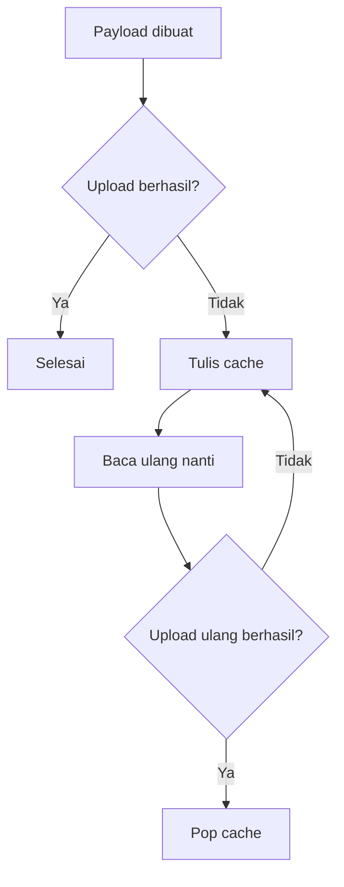

# Caching Local

Caching local adalah penyimpanan sementara di node saat data belum bisa dikirim.

## Bukti dari Kode

`node/lib/NodeCore/storage/CacheManager.h` menyediakan operasi:

- `initImpl`
- `writeImpl`
- `read_oneImpl`
- `pop_oneImpl`
- `get_statusImpl`
- `get_sizeImpl`
- `flush`

`BootManager.cpp` juga mencoba menghapus `/cache.dat` saat crash tertentu sebagai self-healing.

## Alur Konsep

## Kenapa Cache Dibutuhkan

Jika Wi-Fi atau cloud gagal, data sensor tidak langsung hilang. Cache menjaga data agar bisa dikirim ulang.

## Risiko

- file cache rusak,
- filesystem penuh,
- data duplikat,
- pop gagal setelah upload berhasil,
- terlalu sering menulis flash,
- crash saat mutasi cache.

## Catatan File-by-File

Halaman detail `CacheManager.cpp` nanti harus menjelaskan format file, cara head/tail bekerja jika ada, dan kapan `flush()` dipanggil.

Lanjutkan ke [Pengiriman Data](./pengiriman-data.md).
