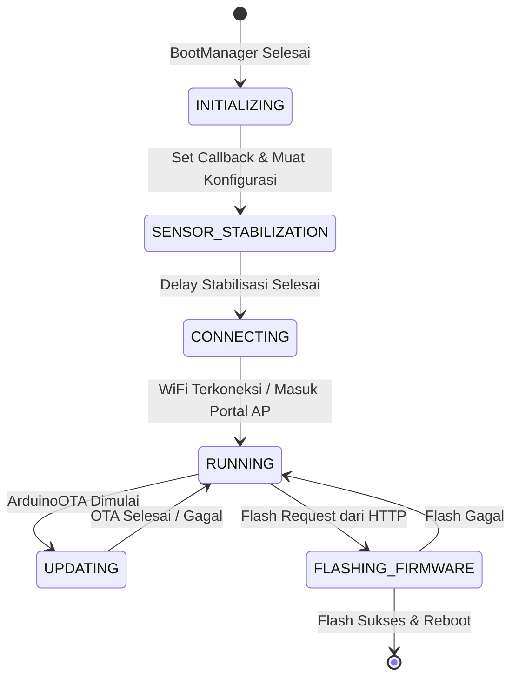

# Cara Kerja Node

Firmware Node dijalankan sebagai sistem mesin status (*state machine*) kooperatif yang terstruktur di dalam file `Application.cpp`. Seluruh eksekusi dijadwalkan secara aktif dalam satu loop utama tanpa memblokir CPU.

---

## Mesin Status Aplikasi (Application State Machine)

Siklus hidup aplikasi diatur oleh enum `Application::State`. Berikut adalah detail transisi state dari saat perangkat menyala:

### 1. State: `INITIALIZING`
* **Deskripsi**: Perangkat mempersiapkan callback pengurus sistem.
* **Proses**:
  * Mengonfigurasi event handler untuk `ArduinoOTA` (mulai sesi, progess bar, error, dan penyelesaian).
  * Mendaftarkan callback untuk HTTP flashing request (`onFlashRequest`).
  * Menerapkan konfigurasi awal ke `ApiClient` dan `OtaManager` via `applyConfigs()`.
  * Berpindah secara otomatis ke state `SENSOR_STABILIZATION`.

### 2. State: `SENSOR_STABILIZATION`
* **Deskripsi**: Sistem memberikan jeda waktu agar pembacaan sirkuit I2C sensor stabil setelah dialiri arus listrik.
* **Proses**:
  * Menunggu durasi stabilisasi (ditentukan oleh `AppConstants::SENSOR_STABILIZATION_DELAY_MS` atau default 2000 ms).
  * Setelah waktu stabilisasi terpenuhi, sistem berpindah ke state `CONNECTING`.

### 3. State: `CONNECTING`
* **Deskripsi**: Node mencoba berinteraksi dengan jaringan nirkabel.
* **Proses**:
  * Memanggil `wifiManager.handle()`.
  * Memantau status WiFi. Jika jaringan berhasil terhubung (`CONNECTED_STA`) atau jika Wi-Fi Manager memutuskan masuk ke portal konfigurasi lokal (`PORTAL_MODE`), sistem langsung memajukan state ke `RUNNING`.

### 4. State: `RUNNING`
* **Deskripsi**: Siklus operasional utama di mana semua layanan dijalankan secara kooperatif.
* **Proses**:
  Setiap siklus loop menjalankan pemanggilan modul sebagai berikut:
  1. **WiFi**: `wifiManager.handle()` menjaga koneksi tetap hidup atau memproses klien portal.
  2. **NTP**: `ntpClient.handle()` memperbarui stempel waktu jika terhubung.
  3. **Sensor**: `sensorManager.handle()` melakukan pembacaan suhu, kelembapan, dan cahaya secara berkala.
  4. **OTA**: `otaManager.handle()` memproses status pembaharuan berkala berbasis awan.
  5. **API Client**: `apiClient.handle()` mengurus antrean payload, verifikasi TLS, dan pengiriman cache.
  6. **App Server**: `appServer.handle()` memproses request dashboard lokal.
  7. **Diagnostics Terminal**: `terminal->handle()` memproses antrean perintah diagnostik interaktif.
  8. **ArduinoOTA**: Memanggil `ArduinoOTA.handle()` yang telah diturunkan frekuensinya (*throttled* dengan timer 100ms) untuk mencegah kelaparan CPU (*CPU starvation*).

### 5. State: `UPDATING`
* **Deskripsi**: Terjadi pembaruan kode biner melalui protokol ArduinoOTA secara nirkabel dari IDE.
* **Proses**:
  * Seluruh penanganan aplikasi dihentikan sementara.
  * Loop utama difokuskan sepenuhnya untuk memanggil `ArduinoOTA.handle()` guna menerima fragmen file biner secepat mungkin.

### 6. State: `FLASHING_FIRMWARE`
* **Deskripsi**: Memasang file biner pembaruan (`/update.bin`) yang diunggah ke LittleFS melalui HTTP.
* **Proses**:
  * Membuka file `/update.bin` di sistem file LittleFS.
  * Menonaktifkan pengawas sistem perangkat keras (`ESP.wdtDisable()`) untuk mencegah reset akibat durasi penulisan flash yang lama (berkisar antara 10-30 detik).
  * Memanggil API internal `Update.begin()`. Jika terjadi kesalahan ruang memori, berkas dihapus dan WDT diaktifkan kembali.
  * Menulis berkas biner ke area memori flash menggunakan `Update.writeStream()`.
  * Mengaktifkan kembali pengawas sistem (`ESP.wdtEnable(8000)`).
  * Jika end update sukses, reason diatur ke `RebootReason::OTA_UPDATE`, berkas dibersihkan, dan sistem melakukan restart otomatis (`ESP.restart()`).

---

## Mekanisme Perlindungan Stabilitas Jangka Panjang

Firmware Node dilengkapi dengan kontrol kesehatan adaptif untuk menghindari kegagalan sistem permanen:

* **Loop Watchdog**: Jika ada satu iterasi loop yang berjalan memblokir CPU melebihi batas waktu toleransi (`LOOP_WDT_TIMEOUT_MS` atau default 8000ms), timer pendeteksi akan mendeteksi kelebihan waktu tersebut dan memaksa ESP8266 restart dengan status reboot `SOFT_WDT`.
* **Safe Mode Auto-Recovery**: Jika sistem mengalami crash berulang hingga masuk ke mode aman (*Safe Mode* / Portal Only), firmware akan menghitung waktu aktif portal. Jika mode portal stabil tanpa crash selama 5 menit (300.000 ms), sistem berasumsi masalah kelistrikan/bus telah reda dan otomatis membersihkan crash counter (`BootGuard::clear()`) untuk membuka jalan masuk kembali ke mode operasi normal pada boot berikutnya.
* **Pemantauan Kesehatan Komponen (SystemHealth)**:
  Komponen kesehatan `SystemHealth::HealthMonitor` mengevaluasi parameter berikut setiap 60 detik:
  * Memori bebas (*free heap*) dan tingkat fragmentasi memori (*max free block size*).
  * Kualitas kekuatan sinyal Wi-Fi (RSSI).
  * Status keaktifan sensor fisik (SHT31 dan BH1750).

  Setiap parameter menghasilkan nilai skor kesehatan dari 0 hingga 100. Jika skor rata-rata berada pada kondisi kritis dan uptime sistem telah melampaui 1 jam (mencegah reboot berulang saat startup), sistem secara proaktif menjadwalkan reboot pemeliharaan dalam waktu 60 detik untuk memulihkan fragmentasi memori Heap.

Lanjutkan ke bagian **[Boot Sequence](./boot-sequence.md)** untuk melihat mekanisme awal ketika perangkat dihidupkan.
