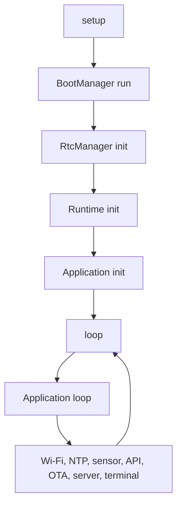

# Cara Kerja Node

Node bekerja sebagai perangkat kecil yang terus berulang: menjaga jaringan, membaca sensor, mengirim data, menangani portal lokal, dan memeriksa update.

## Alur Utama

## State Application

File `node/src/Application.cpp` menunjukkan state penting:

- `INITIALIZING`
- `SENSOR_STABILIZATION`
- `CONNECTING`
- `RUNNING`
- `UPDATING`

Saat init, firmware mengatur Arduino OTA, menerapkan konfigurasi, lalu menunggu stabilisasi sensor. Setelah itu firmware mencoba koneksi dan masuk mode running.

## Pekerjaan Saat Running

Di state `RUNNING`, firmware menjalankan:

1. `wifiManager.handle()`
2. `ntpClient.handle()`
3. `sensorManager.handle()`
4. `otaManager.handle()`
5. `apiClient.handle()`
6. `appServer.handle()`
7. `terminal.handle()`
8. `ArduinoOTA.handle()` secara berkala

## Perlindungan Stabilitas

Firmware memakai beberapa lapisan perlindungan:

- watchdog loop,
- `BootGuard` untuk mendeteksi boot loop,
- health monitor untuk heap, fragmentasi, CPU, Wi-Fi, dan sensor,
- maintenance reboot jika health sangat buruk,
- safe mode portal jika crash terlalu sering.

## Kesimpulan

Node adalah sistem kecil yang berjalan terus menerus. Setiap loop harus menyelesaikan pekerjaan penting tanpa membuat perangkat macet.

Lanjutkan ke [Boot Sequence](./boot-sequence.md).
