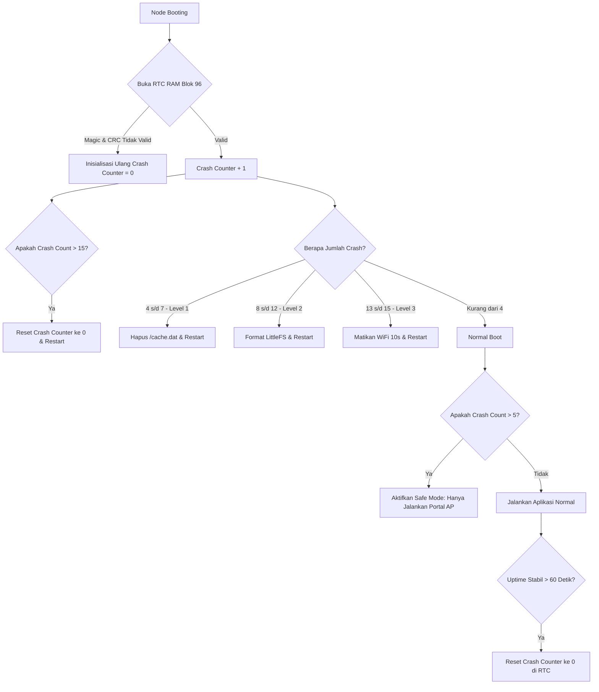

# Panduan Debugging & Troubleshooting Node

Firmware Node ESP8266 dilengkapi dengan sistem pencatatan log modular dan mekanisme pertahanan mandiri (*self-healing*) berbasis kegagalan boot. Panduan ini menjelaskan cara membaca log sistem, mendiagnosis masalah berdasarkan tag log resmi, serta memahami bagaimana perangkat memulihkan dirinya sendiri dari kegagalan parah.

---

## Membaca Log Sistem (Serial & Terminal)

Perangkat menuliskan pesan diagnostik ke port Serial (baud rate `115200`) dan membroadcast log terenkripsi ke client yang terhubung via [DiagnosticsTerminal](file:///home/dhimasardinata/Dokumen/ta/node/lib/NodeCore/terminal/DiagnosticsTerminal.h) WebSocket. Log diformat menggunakan tag penanda kategori di awal baris:

### Daftar Tag Log Resmi dan Kegagalan Terkait

| Tag Log | Kategori | Jenis Kegagalan yang Terdeteksi | Penanganan Sistem |
|---|---|---|---|
| `BOOT` | Inisialisasi Perangkat | Crash berturut-turut pada boot awal, memori RTC rusak, atau filesystem LittleFS gagal di-mount. | Menghitung crash count di RTC RAM, memicu penyembuhan otomatis (Self-Healing). |
| `WIFI` | Manajemen Jaringan | Gagal tersambung ke Access Point, SSID tidak ditemukan, kegagalan alokasi DHCP. | Mencoba berulang kali; masuk ke mode Portal AP jika batas percobaan terlampaui. |
| `HEALTH` | Kesehatan Sistem | Fragmentasi memori RAM kritis, kebocoran heap, deteksi penurunan daya suplai (*brownout*). | Mengawasi memori bebas; melepaskan cache WiFi & cipher; reboot jika RAM habis terus-menerus. |
| `APP` | Loop Aplikasi utama | Sensor macet pada bus I2C, kegagalan membaca data SHT31/BH1750. | Menjalankan I2C recovery (bit-bang SCL 18 kali). |
| `API` | Komunikasi Server | Kegagalan jabat tangan BearSSL TLS, waktu server (NTP) tidak sinkron, server cloud timeout. | Memindahkan data ke Cache lokal (`/cache.dat`), mengaktifkan rute edge. |
| `AUTO-FIX` | Koreksi Otomatis | Kerusakan struktur database sirkular cache, kegagalan fungsi hapus record. | Melakukan pemulihan CRC deep recovery atau memotong data cache yang rusak. |

---

## Siklus Self-Healing BootGuard (RTC RAM)

Jika node ESP8266 mengalami crash berulang kali saat melakukan boot (misalnya karena fragmentasi memori, kebocoran daya, atau LittleFS korup), modul [BootManager](file:///home/dhimasardinata/Dokumen/ta/node/src/BootManager.cpp) akan mendeteksi kegagalan tersebut melalui penghitung crash (*crash counter*) yang disimpan pada memori **RTC RAM blok offset 96** dengan penanda *magic* `0xDEADCAFE`.

Sistem menerapkan tindakan penyembuhan otomatis berjenjang berdasarkan jumlah crash berturut-turut:

### Penjelasan Level Self-Healing:
- **Level 1 (Crash 4 - 7):** Menghapus file lokal `/cache.dat`. Berguna jika kerusakan disebabkan oleh struktur data cache yang korup atau tidak terbaca.
- **Level 2 (Crash 8 - 12):** Memformat ulang partisi filesystem LittleFS secara total. Node akan menonaktifkan Software Watchdog Timer (WDT) selama proses ini karena pemformatan flash membutuhkan waktu beberapa detik dan berpotensi memicu *reset* hardware.
- **Level 3 (Crash > 12):** Menonaktifkan chip WiFi secara fisik selama 10 detik sebelum me-reboot perangkat. Berguna jika terjadi masalah panas pada modul WiFi ESP8266 atau tabrakan saluran sinyal.
- **Safe Mode Portal Only:** Jika crash count berada di atas `5`, perangkat memasuki Safe Mode. Node membatasi diri untuk hanya menjalankan portal konfigurasi lokal (tidak membaca sensor atau mencoba menghubungi cloud/gateway) untuk memberikan kesempatan bagi operator memperbaiki konfigurasi lewat web dashboard. Status crash dibersihkan jika perangkat dapat bertahan menyala normal tanpa crash selama **5 menit (300.000 ms)**.

---

## Langkah Diagnosis Masalah Umum

### 1. Masalah: Perangkat Melakukan Restart Terus Menerus (*Bootloop*)
- **Kemungkinan Penyebab:**
  1. Software Watchdog Timer (WDT) terpicu akibat operasi pemrosesan pembacaan sensor atau pembacaan flash LittleFS yang memblokir loop utama terlalu lama.
  2. Kerusakan memori fisik (RTC RAM tidak dapat menyimpan data dengan benar).
- **Langkah Solusi:**
  - Sambungkan serial monitor dan perhatikan baris log bertag `BOOT`.
  - Kirim perintah `clearcrash` melalui Diagnostics Terminal untuk mereset counter RTC secara manual.

### 2. Masalah: Data Sensor Bernilai Clamped/Flat
- **Kemungkinan Penyebab:**
  - Jalur bus I2C (SDA/SCL) mengalami kondisi terkunci (*stuck-bus*) akibat gangguan noise listrik.
- **Langkah Solusi:**
  - Periksa log tag `APP` untuk melihat laporan pemulihan bus I2C.
  - Periksa fisik pin SHT31 atau BH1750 (ESP8266 menggunakan SDA=D2/GPIO4 dan SCL=D1/GPIO5).
  - Ketik perintah `status` di Diagnostics Terminal untuk melihat telemetri suhu dan kelembaban mentah sebelum dinormalisasi.
